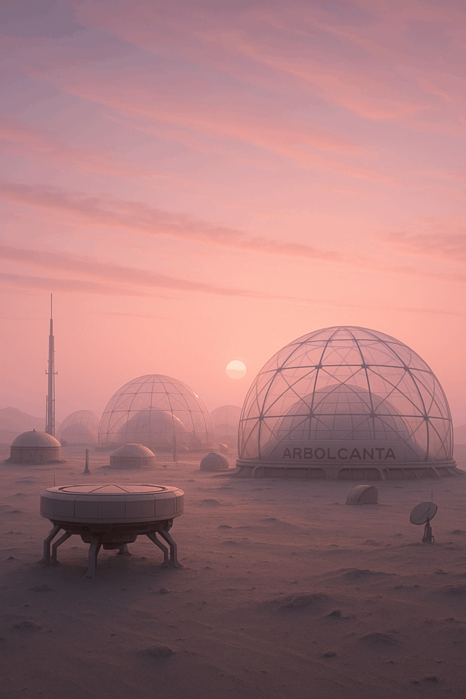
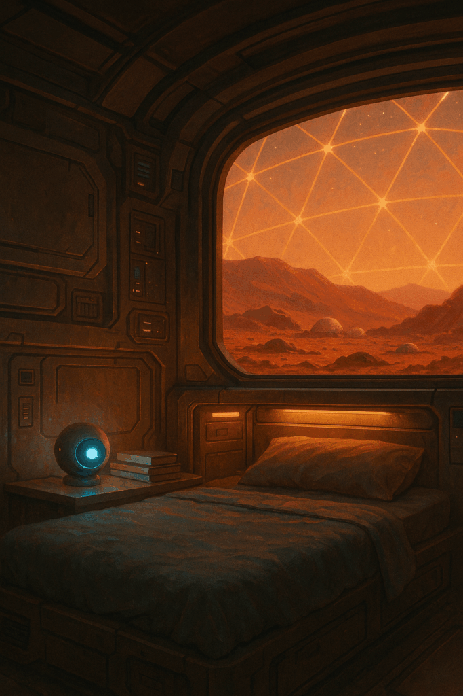

薄紅色の朝日が、透明なドームを通してアルボルカンタ・コロニーの居住区にふわりと流れ込む。  
火星の地表に広がる、薄灰色の砂と根を持たないメタル構造。  
そこで生まれ育った9歳の少年、蒼生は小さなベッドから身を起こし、いつものように窓近くに駆けよった。

「おはよう、NOA」  
蒼生の声に応えて、本のたばの間に置かれた小さな球体が薄蒼色に光った。AI相棒のNOAが起動した合図だった。  
「おはようございます、蒼生。本日も良い天気ですね。火星の大気濃度は正常値、コロニー内の気温は22度です。」  
NOAの声は相変わらず落ち着いていて優しい。でも、蒼生にはどこか、それが機械であることを覚せる凹みを感じるときがあった。

「ねえ、NOA。ぼくのお父さんとお母さんって、本当はどんな人だったの？」  
窓の外を見つめながら、蒼生はそっとつぶやいた。遠くに見える地球の青い星は、今日もとても小さく、手の届かない場所にあった。  
「データベースによると、あなたの両親は地球からの移住者第一代で、コロニー建設に携わった研究者でした。詳細なデータは…」  
NOAの声が、そこで止まった。まるで何かにつまずいたように。

「どうしたの？」  
「申し訳ありません。データアクセスに一時的な問題が発生しています。しかし…」  
NOAの光が一瞬、いつもとは違う色に変わった。深い紫色。あれは、気まぐれな思考を表す色、とNOAのマニュアルには記述されていた。  
「蒼生、あなたには知る権利があります。でも、大人たちが隠している真実があるのかもしれません」  
胸が高鳴る。NOAがこんな言い方をするのは初めてだった。まるで、機械じゃなく、本当の友達のようだった。

その時、居住区の通信システムが起動した。コロニー長の結ひやかな声が部屋に響く。  
「皆さん、おはようございます。本日は月例の記憶アーカイブ整理の日です。不要なデータファイルの削除作業を行いますので、個人端末の電源をお切りください」  
蒼生とNOAは顔を見合わせた…いや、NOAに顔はないけれど、なぜかそんな気がした。  
「蒼生、私には奇妙な感覚があります。この『記憶アーカイブ整理』について、データには残っていない何かを…感じるのです」

窓の外では他の子どもたちが元気に遊んでいた。でも蒼生の心には、小さな疑問の種が芽生えていた。  
NOAが言う通り、大人たちが隠している真実があるのだろうか？  
そして、なぜNOAは今日に限って、こんなにも…人間らしいのだろう？  
「NOA、ぼくたち、真実を探してみない？」  
蒼生の瞳に、初めてみる決意の光が居着いた。
