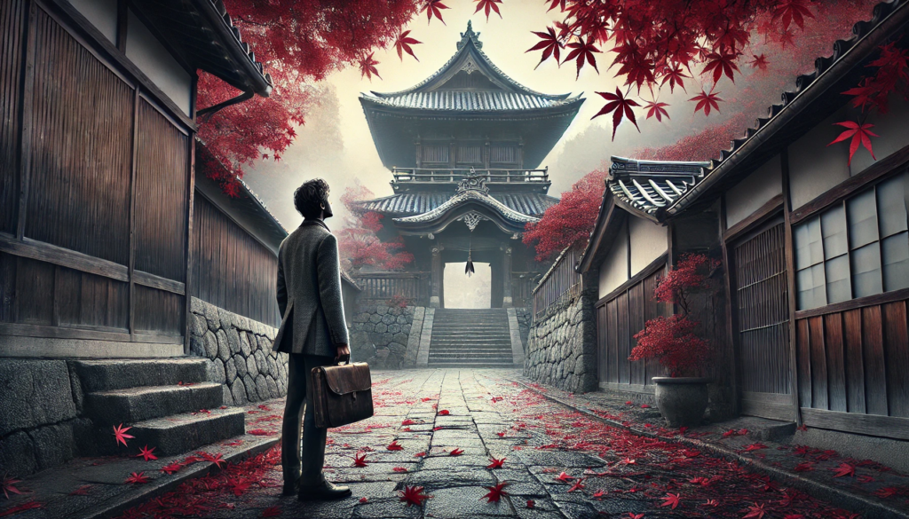
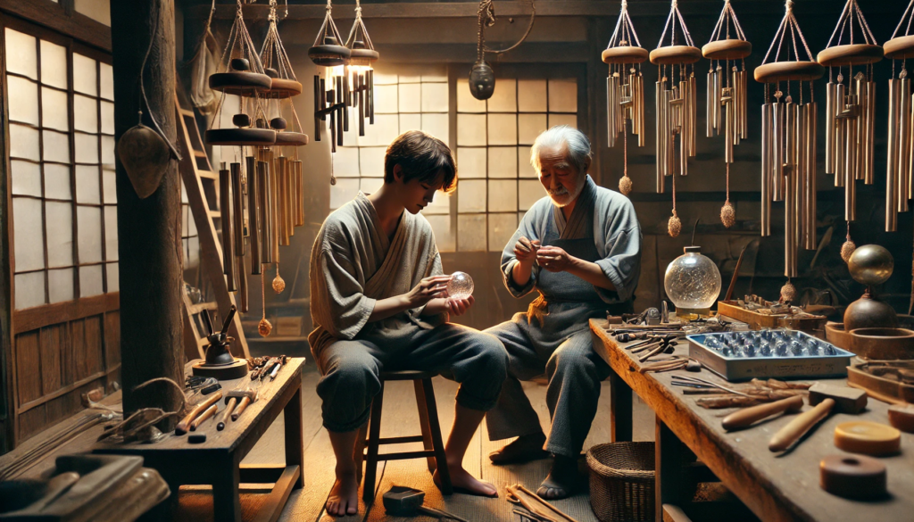
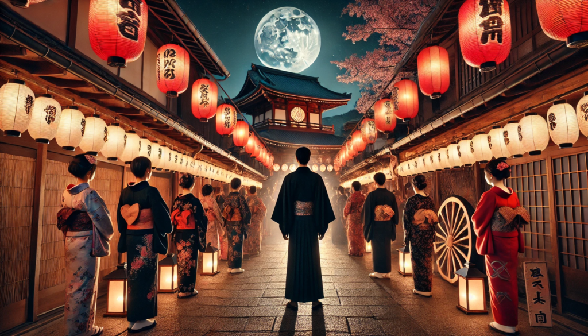
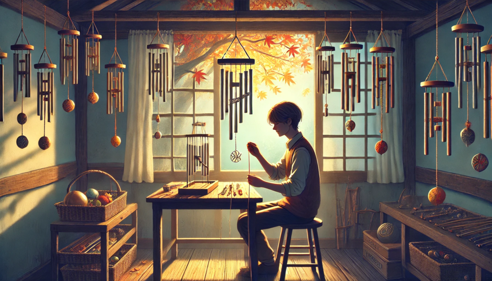

秋風が柔らかく吹き抜ける大分の小さな町では、紅葉が一面を覆い、地面に散る葉が静かな音を立てていた。石畳の路地は朝露でほのかに光り、古びた寺院の鐘楼からは微かな風鈴の音が聞こえる。その音はまるで、時を越えた記憶を呼び覚ますような響きだった。

高橋智也は、都会での喧騒から逃げ出すようにしてこの町を訪れた。仕事に追われる日々に疲れ果て、何を求めてここに来たのか自分でもわからなかった。ただ、幼い頃に祖母に連れられて訪れたこの寺院が、どこか彼を引き寄せたのだ。

寺院の境内に足を踏み入れた智也は、風に揺れる一つの風鈴に目を留めた。その風鈴は他のものよりも強く揺れており、透明な音色を響かせていた。その音を聞くたび、彼の胸の奥に封じ込めていた感情が少しずつ溶け出すようだった。

「その風鈴、あなたを気に入ったみたいですね。」

低く穏やかな声が智也の背後から響いた。振り返ると、一人の若い職人が立っていた。

彼の名はハルオ。地元で伝統的な風鈴を作り続ける職人だった。ハルオは痩せた体に粗い作務衣をまとい、手には赤い絹糸で吊るされた新しい風鈴を持っていた。彼の顔には、都会の人間にはない穏やかで誇り高い表情が浮かんでいた。

「風鈴が…人を気に入るなんて、どういうことだ？」

智也が苦笑混じりに尋ねると、ハルオは微笑んで言った。

「風鈴は、人の心を映す鏡みたいなものです。気持ちが澄んでいれば、その響きも美しく聞こえる。」

その一言が、智也の心を強く揺さぶった。

その後、智也とハルオは寺院近くの茶屋で話をした。智也は祖母との思い出を語り、ハルオは父親と共に風鈴を作っていた日々について話した。

「父は、風鈴はただの飾りではなく、心の声を代弁するものだと言っていました。音を聞いた人が、自分自身と向き合うきっかけになると信じていたんです。」

ハルオの言葉を聞きながら、智也は仕事に追われるうちに忘れていた感覚を思い出し始めていた。

数日後、智也はハルオの工房を訪れた。そこは木の香りと微かな金属の匂いに包まれており、静かな中にも創造のエネルギーが満ちていた。智也は、風鈴作りを手伝い始めた。彼の不器用な手つきにハルオは時折笑ったが、智也はその作業に夢中になった。

「これが最後の仕上げです。」

ハルオが言い、智也に赤い絹糸を手渡した。智也は、自分で作った風鈴を吊るし、音を確かめた。その音は、驚くほど澄んでいて、温かみを感じさせるものだった。

数週間後、寺院での風鈴の奉納式が行われた。町の住人が集まり、新たに吊るされた風鈴の音に耳を傾けていた。その中には智也とハルオもいた。

風鈴の音が響くたび、智也は心が軽くなるのを感じた。それは、彼が忘れていた祖母との思い出や、自分自身の内なる声を思い出させるものだった。

「ありがとう、ハルオさん。あなたのおかげで、自分を取り戻せた気がする。」

智也が感謝の言葉を述べると、ハルオは微笑みながら答えた。

「こちらこそ。あなたが手伝ってくれた風鈴が、また誰かの心に響くことを願っています。」

**エピローグ**

数年後、智也はこの町に移り住み、自らも風鈴作りを始めた。彼の窓辺には、あの日作った風鈴が吊るされている。その音を聞くたび、彼は過去の自分と向き合い、未来への希望を抱くことができるのだった。

風が吹き、智也の風鈴が再び澄んだ音を響かせた。その音は、町全体に広がり、新たな物語の始まりを告げているかのようだった。

## **Echoes of the Chime**

The rustling autumn breeze caressed the quiet town of Oita, scattering crimson and gold leaves across cobblestone paths glistening with morning dew. The sound of a wind chime, faint yet captivating, emanated from the belfry of a centuries-old temple, its delicate melody weaving through the air like a whisper from the past.

Tomoya Takahashi, a disillusioned office worker in his early thirties, arrived in this tranquil town seeking solace. The constant hum of the city had worn him thin, and though he wasn’t entirely sure why he came, memories of visiting the temple with his late grandmother drew him here.

As he wandered into the temple grounds, a particular wind chime caught his attention. It swayed more vigorously than the others, its crystalline notes resonating deeply within him. Each chime seemed to loosen the knots in his chest, releasing fragments of emotions he’d long suppressed.

“Seems like it’s chosen you,” a voice called out, low and steady. Tomoya turned to see Haruo, a craftsman with calloused hands and a serene expression. Haruo, who had inherited the art of wind chime making from his father, stood with a fresh creation in his hand, its delicate bell suspended by a crimson silk thread.

“Chosen me?” Tomoya echoed with a skeptical laugh. “It’s just a piece of glass and metal.”

Haruo smiled knowingly. “Wind chimes mirror the heart. If you listen closely, you’ll hear what it’s trying to tell you.”

Tomoya hesitated, struck by the simplicity yet depth of Haruo’s words. The two found themselves at a teahouse near the temple, sharing stories. Tomoya recounted his memories of visiting the temple with his grandmother, while Haruo shared the philosophy his father had passed down: that each wind chime carries a fragment of the craftsman’s soul, waiting to resonate with the right person.

In the days that followed, Tomoya visited Haruo’s workshop, a sanctuary of wood and metal. The scent of varnish mingled with the faint tang of iron. Tomoya’s hands, unused to such labor, clumsily molded wire and polished glass. Haruo chuckled but guided him with patience, their shared silence often broken by the gentle chime of the wind bells.

“This is the final step,” Haruo said one afternoon, handing Tomoya a length of crimson thread. Tomoya tied it carefully, suspending his handcrafted chime. When it sang its first note, the sound was warm and soothing, carrying a depth that Tomoya had never thought possible.

Weeks later, the temple hosted its annual wind chime dedication ceremony. Townsfolk gathered as the new chimes were hung, their melodies mingling with the cool evening breeze. Tomoya’s creation hung proudly among them, its unique tone echoing across the grounds.

“Thank you,” Tomoya said, his voice heavy with emotion. “I feel like I’ve found a piece of myself I lost long ago.”

Haruo placed a hand on his shoulder. “And now, you can pass that piece on to others.”

The two stood in silence, listening as the chimes sang a symphony of hope and renewal. Each note was a reminder of the past, a bridge to the present, and a promise for the future.

**Epilogue**

Years later, Tomoya, now a skilled craftsman, set up his own workshop in the town. His wind chimes, imbued with his newfound peace, became sought after for their unique resonance. On the windowsill of his workshop hung his first creation, its melody a constant source of inspiration.

As the autumn breeze swept through the town, Tomoya’s chime sang once more, its echoes carrying stories of connection, healing, and a future shaped by harmony.
