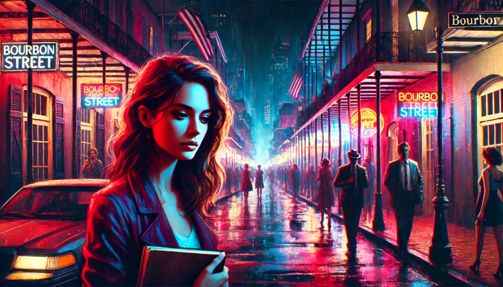
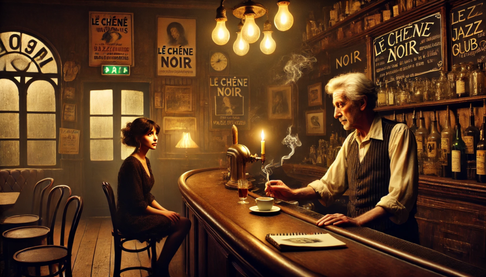
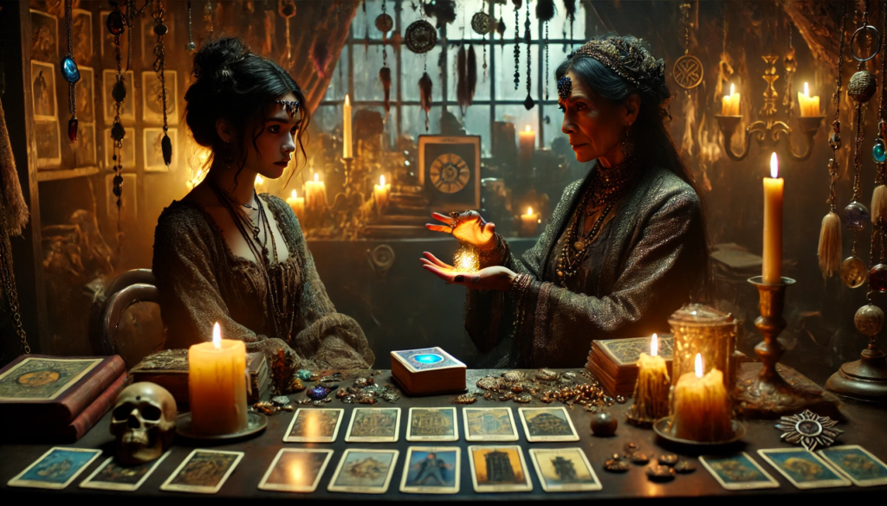
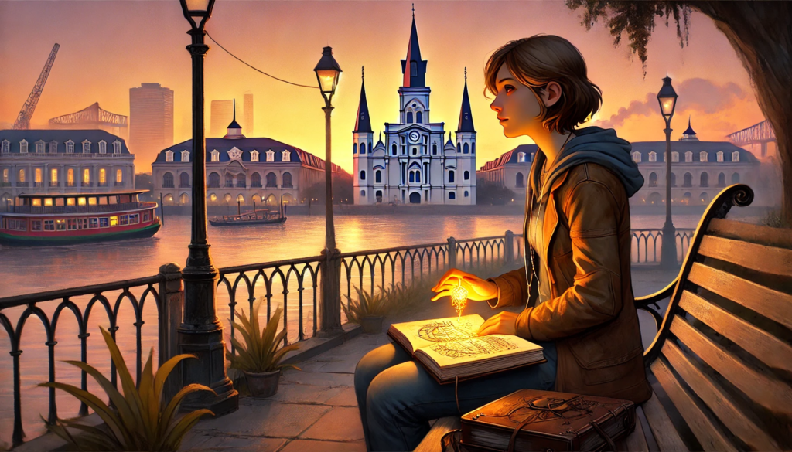

ニューオーリンズの夜の湿った空気がクララ・デュポンの肌にまとわりついていた。彼女がバーボンストリートを歩くと、ネオンの光が赤や紫に夜を彩り、空気中のジャズの旋律が彼女の記憶をかき立てた。忘れたはずの過去が蘇る。

28年ぶりにこの街に戻ることは、夢の中に足を踏み入れるような、あるいは幽霊話の一部になるような感覚だった。ニューヨークで育ち、そこを故郷としてきたが、祖母セレステの失踪という謎が彼女をこの蒸し暑い謎めいた街へと引き戻した。

スケッチブックをぎゅっと握りしめたクララは、自分の人生を描く道具として、それを手放すことができなかった。「彼女がなぜ消えたのか知りたい」そう自分に言い聞かせながら、フレンチ・クオーターの奥深くへと足を踏み入れた。

古びたジャズクラブの秘密

クララが足を踏み入れたのは、暗がりの中にたたずむジャズバー「ル・シェーヌ・ノワール」だった。年老いたバーテンダーのポールが疲れたように彼女に頷いた。タバコと古い木の匂いが空気を満たしていた。

クララがセレステの名を口にすると、ポールの手が止まり、彼の表情が暗くなった。「セレステの孫娘か」と彼は呟き、バーの奥から一枚の古い写真を取り出した。

写真の中には、カメラの向こうを見透かすような鋭い目つきをした男性と並ぶセレステが写っていた。ポールは彼をアンドレ・ルブランと名付け、ニューオーリンズの裏社会に通じる人物であると語った。

「彼女は彼に深く関わりすぎたんだ」とポールは後悔の色を浮かべながら語った。「何が起こったにせよ、それはアンドレとの関係から始まったんだよ」

占い師アマラの導き

翌日、クララはアマラという名の占い師を訪ねた。ろうそくの明かりが灯る彼女の店で、アマラはタロットカードを広げた。指が不吉な「塔」のカードの上で止まる。

「あなたの祖母はただの歌手じゃなかったのよ」とアマラは言った。「彼女はこの街の闇を封じ込めようとした守護者だったの」

クララはアマラから小さく精巧に彫られた護符を渡された。それはまるで祖母の魂を宿しているかのように温かさを感じた。

闇との対峙

その夜、クララは祖母の最後の行方が確認された古びたジャズクラブの廃墟を訪れた。静寂は風のささやきだけに破られた。ステージの上に人影が現れる。

「アンドレ・ルブラン」とクララは震える声で呟いた。

「ここに来るべきじゃなかった」と彼は空間に響くように語った。

「祖母はなぜ消えたの？何をしたの？」と問い詰めるクララ。

アンドレの目が柔らかくなる。「彼女はすべてを捧げてこの街を守ったんだ。この街の痛み、憎しみ、絶望―彼女はそれを自身の中に封じ込めて、人々を愛するために」

クララの手の中の護符が熱を帯び、微かに光を放った。その瞬間、彼女は祖母の存在を感じた―強く、愛に満ち、しかし犠牲に重荷を感じている。

新たな使命

夜明けを迎え、クララはミシシッピ川を眺めながらベンチに座っていた。祖母の護符が胸元で温かく感じられた。「あなたはこの街を救ったのね、グランメール」彼女は囁いた。「今度は私があなたの使命を受け継ぐわ」

スケッチブックを開いたクララは描き始めた。その線はニューオーリンズの街並みだけでなく、その人々の魂をも捉えていた。

エピローグ：記憶のキャンバス

数か月後、クララの作品はニューオーリンズの中心にあるギャラリーで展示された。訪問者たちは彼女の中心作品「バーボンストリートのささやき」に感嘆した。その絵画からは街のジャズと魂が響いてくるようだった。

外では、街の旋律が鳴り続けていた。クララはガス灯の下に立ち、護符に触れた。祖母は彼女に語るべき物語を残してくれた。クララはニューオーリンズの鼓動を未来の世代に伝えることを決意していた。

## **Echoes of the Quarter**

The sultry humidity of a New Orleans night clung to Clara Dupont as she walked down Bourbon Street. Neon lights painted the night in hues of red and violet, and the jazz melodies in the air stirred memories she thought she had long left behind.

Returning to this city after 28 years felt like stepping into a dream—or perhaps a ghost story. New York had been her home since childhood, but the mystery of her grandmother Celeste’s disappearance had pulled her back to this sweltering, enigmatic city.

Clara’s hands tightened around her sketchbook, the tool she used to make sense of the world. “I have to know why she vanished,” she whispered to herself, her resolve solidifying as she wandered deeper into the heart of the Quarter.

**The Old Jazz Club’s Secrets**

Clara entered a dimly lit jazz bar, **Le Chêne Noir**, where an aging bartender named Paul greeted her with a weary nod. The smell of tobacco and old wood filled the air.

When Clara mentioned Celeste’s name, Paul’s hand faltered, and his expression darkened. “Celeste’s granddaughter, are you?” he muttered, pulling out an old photograph from behind the bar.

In the picture, Celeste stood with a man whose piercing gaze seemed to look through the camera. Paul identified him as André LeBlanc, a shadowy figure linked to the city’s underworld.

“She was tied to him in ways that ran too deep,” Paul said, his voice tinged with regret. “Whatever happened, it started with André.”

**Amara the Seer**

The next day, Clara sought out Amara, a voodoo practitioner renowned for her insights. In her candlelit shop, Amara laid out tarot cards. Her fingers hovered over the ominous Tower card.

“Your grandmother wasn’t just a singer. She was a protector,” Amara explained, handing Clara a small, intricately carved talisman. “She tried to seal away a darkness that still lingers in this city.”

Clara felt a warmth emanating from the talisman, as if it carried her grandmother’s spirit.

**Confronting the Shadows**

That night, Clara ventured to the ruins of an old jazz club—Celeste’s last known location. The silence was thick, broken only by the whisper of the wind. On the stage, a figure materialized.

“André LeBlanc,” Clara breathed, her voice trembling.

“You shouldn’t have come here,” he said, his voice echoing through the empty space.

“Why did my grandmother disappear? What did she do?”

André’s eyes softened. “She gave everything to protect this city. The pain, the hatred, the despair of New Orleans—she trapped it within herself to save the people she loved.”

The talisman in Clara’s hand grew hot, glowing faintly. In that moment, she felt Celeste’s presence—strong, loving, yet burdened by sacrifice.

**A New Purpose**

As dawn broke, Clara sat on a bench overlooking the Mississippi, her grandmother’s talisman warm against her chest. “You saved this city, Grandmère,” she whispered. “Now, I’ll carry your mission forward.”

Opening her sketchbook, Clara began to draw. Her lines captured not just the streets of New Orleans but the soul of its people.

**Epilogue: A Canvas of Memories**

Months later, Clara’s artwork was displayed in a gallery in the heart of New Orleans. Visitors marveled at her centerpiece, **Echoes of the Quarter**, a painting that seemed to hum with the jazz and soul of the city.

Outside, the melodies of the street carried on. Clara stood beneath a gas lamp, her fingers brushing the talisman. Her grandmother had given her a story to tell, and Clara was determined to preserve the heartbeat of New Orleans for generations to come.
