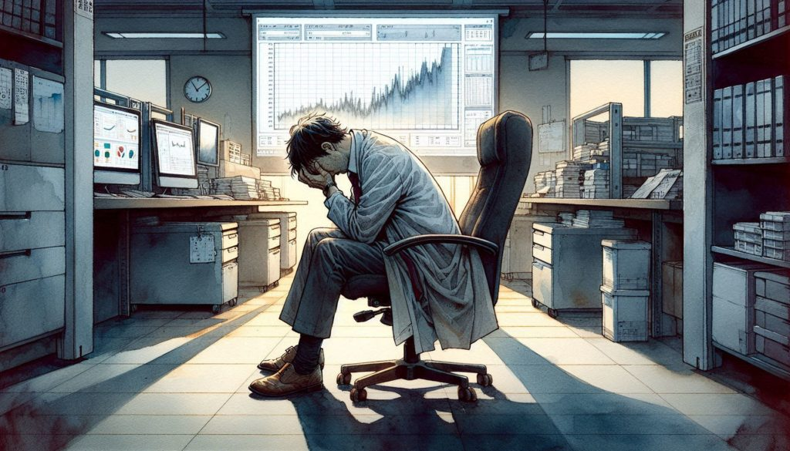
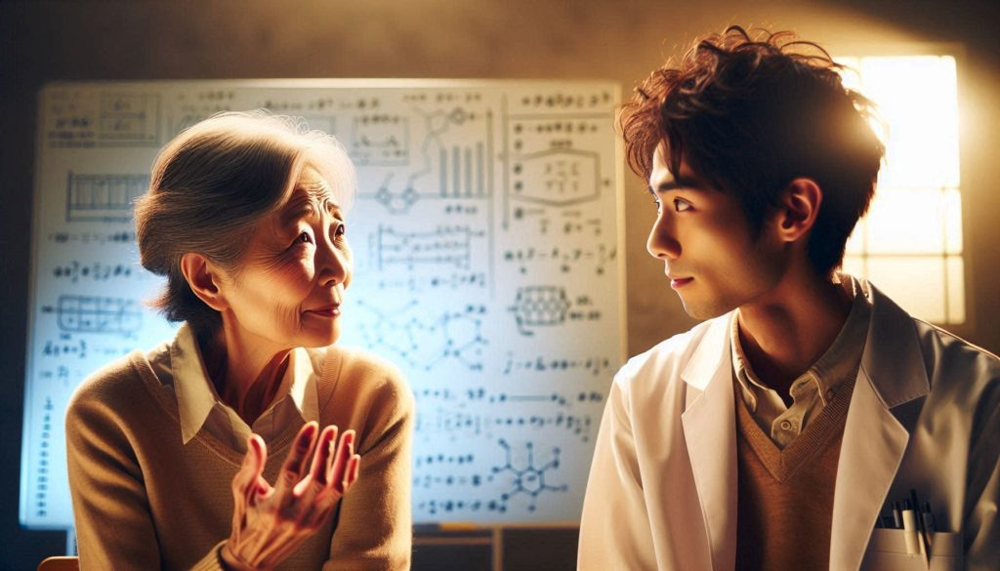
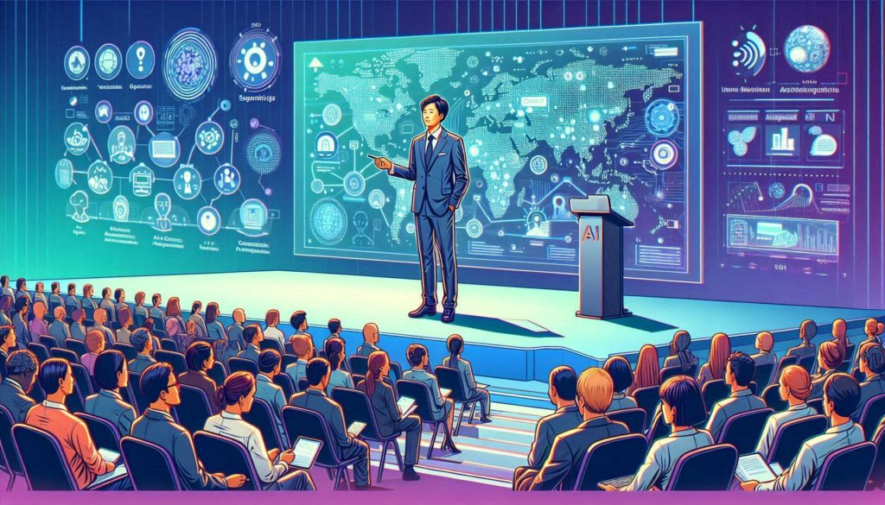

## 第1章: 期待と現実

東京の賑やかな街を吹き抜ける爽やかな秋風が、変化の香りを運んでいた。通勤者の海と聳え立つ高層ビルの中に、東京先端技術研究所がそびえ立っていた。その洗練されたガラスのファサードは、沈みゆく太陽の温かな色合いを反射していた。数多くある研究室の一つで、45歳の人工知能研究者、藤原健太郎が、コンピューターに向かって身を屈めていた。彼の目は画面に釘付けで、その眼差しは20年に及ぶ献身を物語っていた。

健太郎の指が少し震えながら、彼の人生の集大成である革命的なAIアルゴリズム - 気候変動の影響を予測し緩和するためのもの - の最終パラメータを入力していた。塩コショウ頭と目の周りの深いしわは、彼が研究を磨くために費やした数え切れない夜を物語っていた。

「いよいよだ」彼は周りのコンピューターのうなり声にかき消されそうな声で呟いた。深呼吸をして、彼は'Enter'キーを押した。

画面がちらつき、数字とグラフが目まぐるしく踊るように表示された。健太郎の心臓は高鳴り、20年に及ぶ懸命な努力を正当化する結果を待つ間、手のひらに汗がにじんだ。

突然、コンピューターが音を鳴らした。データが落ち着き、健太郎の目が驚きで見開かれた。

「いや...これはおかしい」彼は慌てて数字を何度も確認しながら呟いた。しかし、真実は否定できなかった - 彼の画期的なアルゴリズム、20年の研究の成果は、既存のモデルよりもわずかに良い結果しか生み出していなかったのだ。

健太郎は椅子に崩れ落ち、絶望の波が押し寄せてきた。「20年だぞ」彼は空っぽの研究室に向かって、声を震わせて言った。「20年かけて...これか？」

## 第2章: メンターの知恵

状況の現実が沈み込む中、健太郎は背後に人の気配を感じた。振り向くと、彼のメンターでAI部門の責任者である田中ゆき博士が、ドアの所に立っていた。

「藤原さん」彼女は柔らかく、理解に満ちた目で言った。「結果を見ました。入っていいですか？」

健太郎は無言でうなずき、近くの椅子を指さした。田中博士は座り、落胆した同僚をじっと見つめた。

「これがあなたの望んだ結果でないことはわかります」彼女は優しくも毅然とした声で切り出した。「でも、一つ聞かせてください。この20年間で、他に何を発見しましたか？」

健太郎は困惑した表情で彼女を見た。「どういう意味ですか？」

田中博士は微笑んだ。「科学は結果だけじゃないんです、藤原さん。それは旅なんです。途中で私たちが行う小さな発見の積み重ねなんです。それらについて教えてください。」

## 第3章: 旅路の再発見

健太郎が話し始めると、長年にわたって得た様々な洞察や小さな突破口を思い出し、徐々に声に力強さが戻ってきた。彼が開発した改良されたデータ処理技術、偶然思いついたニューラルネットワークアーキテクチャへの斬新なアプローチ、そして指導してきた数多くの学生たちについて語った。

田中博士は熱心に耳を傾け、健太郎の情熱が再び燃え上がるのを見て頷いていた。彼が最後に黙り込んだとき、彼女は身を乗り出し、目を輝かせた。

「わかりませんか、藤原さん？これらの'小さな'発見は、すでに違いを生み出しているんです。あなたのデータ処理方法は、病院で患者データをより効率的に分析するのに使われています。あなたのニューラルネットワークアーキテクチャはロボット工学に応用されています。そして、あなたが指導した学生たち？彼らは今、私たちが想像もできないような方法でAIの境界を押し広げているんです。」

健太郎は驚愕の沈黙に包まれ、彼女の言葉の重みが沁みこんでいった。コンピューター画面を見直すと、彼の仕事を新しい光の中で見ることができた。それは失敗ではなく、より大きな科学的努力の一部である小さいが重要な踏み石だったのだ。

## 第4章: 知識の共有

その後の数週間、健太郎は自分の研究を共有することに没頭した。当初描いていた画期的な気候変動解決策としてではなく、価値ある洞察と技術の集大成として。驚いたことに、彼の仕事は世界中の研究者によって引用され、さらに発展させられていることがわかった。

## 第5章: 新たな視点

運命の夜から1年後のある爽やかな秋の日、健太郎は国際AIカンファレンスの満員の講堂の前に立っていた。彼が自身の旅路と'小さな'発見の予想外の影響について発表すると、若い研究者たちの顔がインスピレーションを得て輝くのが見えた。

その瞬間、健太郤は20年に及ぶ探求の真の価値が、彼が作り上げたアルゴリズムにあるのではなく、彼が共有した知識、影響を与えた人々の人生、そして彼が触発した未来の発見にあることを悟った。そして、熱心な顔の海を見渡しながら、彼は自分の旅路が、すべての浮き沈みを含めて、一瞬一瞬が価値あるものだったことを知ったのだった。

## エピローグ

この物語は、科学的発見の予測不可能な性質と、知識共有の重要性を探求している。主人公の健太郎を通じて、読者は科学的探求の真の価値が必ずしも画期的な発見だけにあるのではなく、その過程で得られる多くの小さな洞察や、他者に与える影響にもあることを学ぶ。物語は、失敗と思われたものが実は大きな成功への踏み石となりうることを示唆し、読者に忍耐と広い視野の重要性を訴えかける。
