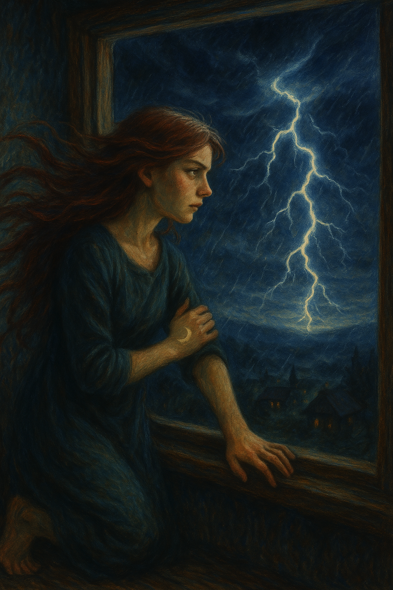

東京の真夏、日差しは鋭い光線となってアスファルトを照らし、通りを歩く人々は影を探して歩いていた。空気には熱と湿気が混じり、息をするだけで重苦しさを感じる。そんな都会の喧騒の中、藤原健太郎は研究室のモニターに目を凝らしていた。

彼の勤務先である「未来AI研究所」は、最先端の人工知能開発で知られるが、膨大な電力消費と冷却問題に悩まされていた。研究室に並ぶサーバー群は、静かな唸りをあげながら稼働している。だが、冷却装置が限界を迎えつつあるのは明らかだった。空調はフル稼働しているにもかかわらず、室温は上がり続けていた。

「これでは、いずれ限界が来る。」健太郎は額の汗を拭いながら呟いた。データの向こう側には、彼の開発した自然言語処理モデルが動いている。もし冷却装置が完全に停止すれば、これまでの研究が失われるどころか、設備自体が損傷しかねない。

その日、研究室の一角で同僚の由紀が駆け込んできた。「健太郎さん、大変です！メイン冷却システムがエラーを起こしています！」彼女の顔には焦りがにじみ出ていた。

健太郎は冷静を装いながらも、胸の奥で不安が膨らむのを感じた。「バックアップを起動して、エラーの詳細を確認しよう。」指示を出す彼の声には、わずかな震えが混じっていた。

チーム全体が慌ただしく動き出したが、バックアップシステムは既に負荷に耐えきれない状態だった。外の気温も災いし、サーバールームの温度は急上昇を続けている。健太郎は立ち止まり、自問した。「本当に手は尽くしたのか？」

ふと彼の頭に閃きが生まれた。「AIを冷却問題の解決に使えないだろうか？」そのアイデアは突飛に思えたが、今の状況では試す価値がある。

チームは急遽、AIに冷却システムの設計図や温度データを入力した。研究のために設計されたAIが、今度は研究を守るために稼働する。数分後、AIは複数の代替案を提示した。その中には、配管の再配置や新しい冷却剤の使用など、斬新な提案が含まれていた。

「これだ！」健太郎は指差した。提案されたプランは即座に実行に移され、温度は徐々に下降し始めた。彼らの努力が実を結んだ瞬間だった。

数ヶ月後、健太郎は国際会議の壇上に立っていた。「我々はAIを共闘者として迎え入れ、課題を乗り越える道を見つけました。」彼の言葉には自信と情熱が込められていた。

背後のスクリーンには、新しい冷却管理システムの映像が映し出されている。それは、研究所の小さな革命から生まれた、大きな未来への一歩だった。

**終わりに**

冷却問題という一つの課題を突破口に、AIと人間の新たな可能性が描かれたこの物語。東京の灼熱の夏から生まれた小さな革命は、やがて世界中の課題解決の原動力となるだろう。

## **AI and the Heat Symphony: A Revolution for a Cooler Future**

In the scorching summer of Tokyo, the blazing sunlight pierced the asphalt, driving people to seek refuge in the shadows as they walked. The air was thick with heat and humidity, making even the act of breathing feel burdensome. Amidst the chaos of the city, Kentaro Fujiwara focused intently on the monitor in his lab.

His workplace, the Future AI Research Institute, was renowned for cutting-edge artificial intelligence development. However, it grappled with monumental energy consumption and persistent cooling challenges. Rows of servers hummed quietly as they worked tirelessly, but it was clear that the cooling systems were nearing their limits. Despite air conditioning operating at full capacity, the room’s temperature continued to rise.

“At this rate, it’s only a matter of time before we hit the breaking point,” Kentaro muttered, wiping the sweat from his brow. Beyond the data displayed on the screen, his groundbreaking natural language processing model was running. If the cooling system were to fail entirely, years of research could be lost, and the equipment itself might suffer irreparable damage.

That day, Yuki, a colleague, burst into the lab. “Kentaro, we’ve got a serious problem! The main cooling system has encountered an error!” Her face was pale with urgency.

Kentaro, striving to appear calm, felt anxiety bubbling deep within. “Activate the backup system and check the error details,” he instructed, his voice carrying a faint tremor.

The entire team sprang into action, but the backup system was already straining under the workload. To make matters worse, the outside temperature exacerbated the situation, and the server room’s thermometer continued to climb alarmingly. Kentaro paused amidst the frenzy, questioning himself: “Have we truly exhausted all options?”

Suddenly, a spark of inspiration struck him. “Could we use the AI itself to solve the cooling problem?” The idea seemed unconventional, but given the dire circumstances, it was worth attempting.

The team hurriedly fed the AI with blueprints of the cooling system and temperature data. The AI, originally designed to push the boundaries of research, now turned its computational power to safeguarding its own operations. Within minutes, it presented several alternative solutions. Among them were innovative proposals like reconfiguring the piping layout and introducing a new type of coolant.

“This is it!” Kentaro exclaimed, pointing to a particular plan. The team immediately set to work implementing the solution. Slowly but surely, the temperature began to drop. Their efforts had borne fruit.

Months later, Kentaro stood on the stage of an international conference. “We have found a path to overcoming challenges by embracing AI as a collaborative partner,” he declared with confidence and passion.

Behind him, the screen displayed visuals of the newly developed cooling management system. It was a testament to a small revolution born in the research lab, marking a significant leap toward a promising future.

**Conclusion**

This story, born out of the challenge of cooling, illustrates a new realm of possibilities for collaboration between AI and humanity. The small revolution sparked in Tokyo’s sweltering summer has the potential to become a driving force for solving challenges worldwide.
