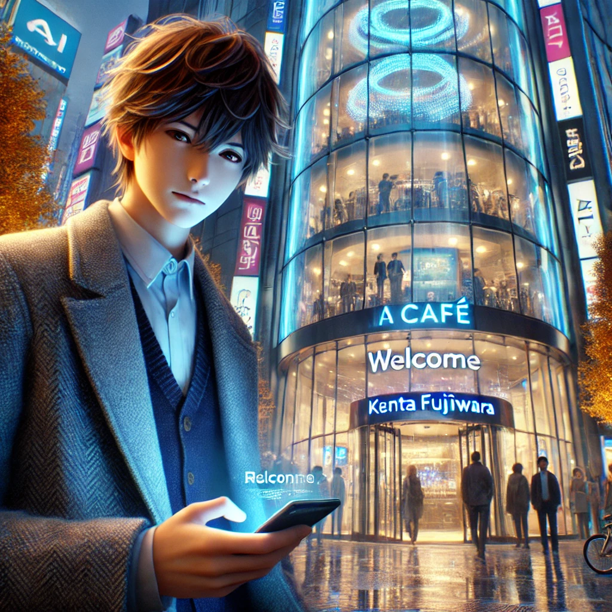
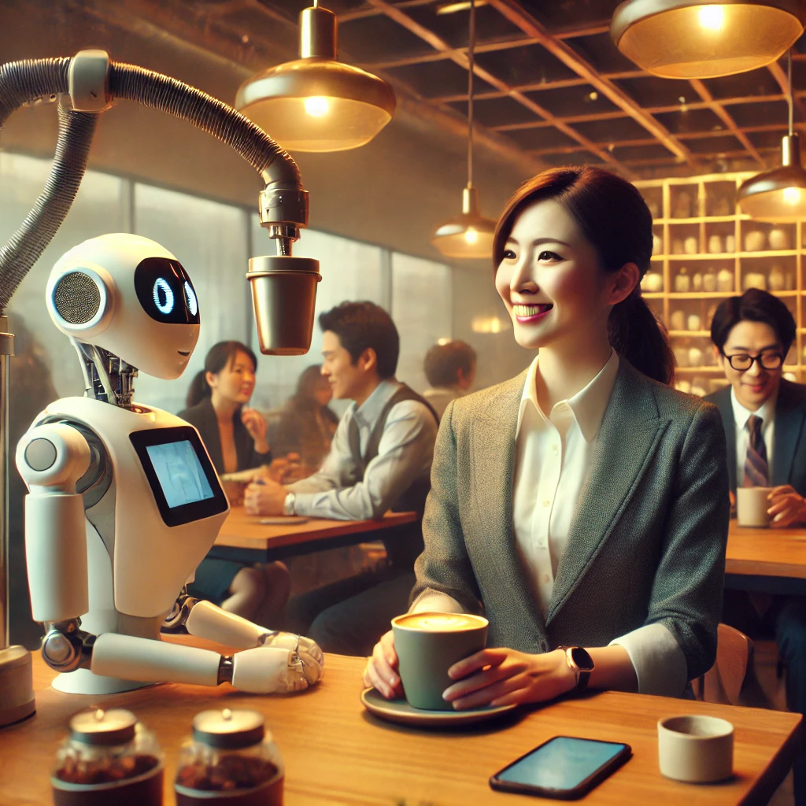
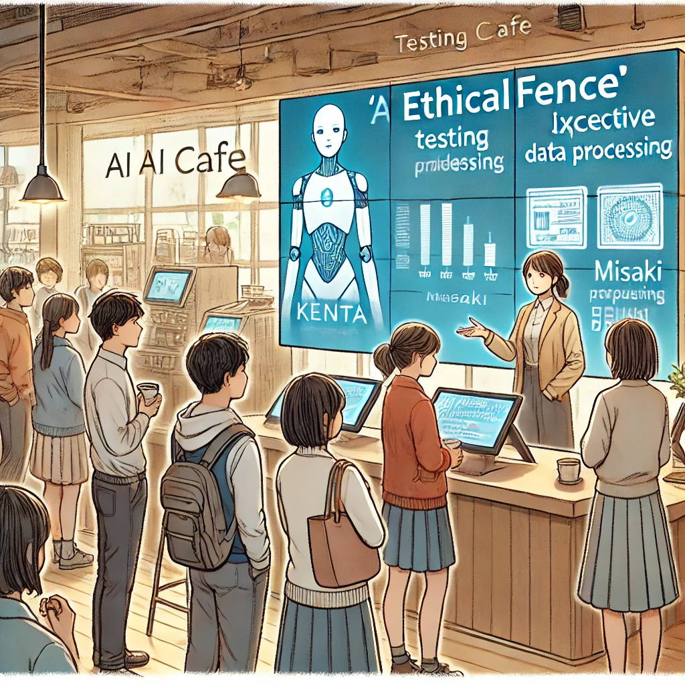
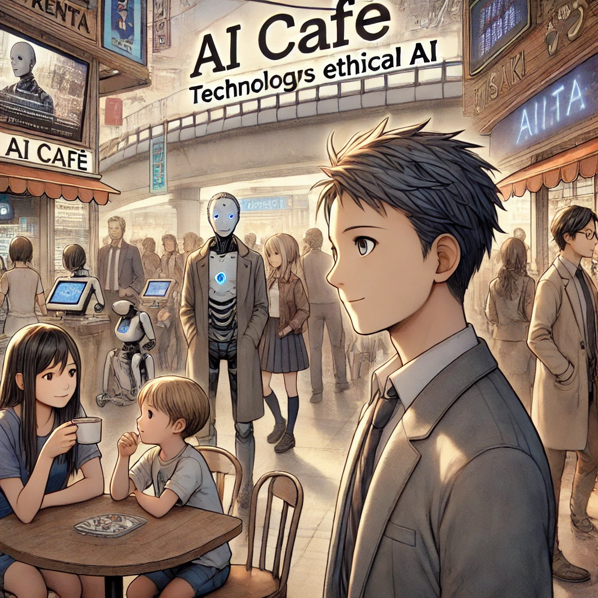

冷たい秋風が秋葉原の街路を吹き抜ける中、藤原健太郎はAIカフェの前に立ち尽くしていた。未来的なデザインの店舗は静かに輝き、柔らかなLEDの光がガラス張りの外壁に反射している。その近未来的な美しさに圧倒されつつも、彼の胸には複雑な思いが渦巻いていた。

手の中のスマートフォンが微かな振動を発し、画面には「ようこそ、藤原様。本日は特別割引をご提供します」とのメッセージが表示された。それはジオフェンシング技術と個人データの結びつきによるサービスであることを健太郎は理解していたが、自分の行動が追跡されているという現実には、やはり微かな不安を感じた。しかし、技術者としての好奇心がその不安を打ち消し、意を決してドアを押し開けた。

**AI****カフェでの出会い**

店内に入ると、空調の快適な温度とほのかなアロマの香りが彼を包み込んだ。ロボットアームが滑らかにコーヒーを淹れる様子が目に入り、その精密さに思わず目を奪われた。店内には様々な客が集まり、スマホやタブレットを操作する人々、AIシステムについて議論を交わすグループが見られた。

「藤原さん？」

聞き覚えのある声に振り向くと、そこには新人政治家として注目を集める伊藤美咲が座っていた。議会でAIやデータプライバシーの課題に取り組む彼女は、過去にIT業界との懇談会で顔を合わせたことがある人物だった。

「伊藤さん……お久しぶりです。こんなところで会うとは思いませんでした。」

健太郎がそう言うと、美咲は微笑みながら席を勧めた。

「私も少し驚きましたが、ここは勉強になる場所ですね。AI技術がどれだけ日常に浸透しているか、肌で感じたくて来たんです。」

彼女の率直な言葉に、健太郎は敬意を抱いた。二人の会話は徐々に深まり、技術が人間の生活に与える影響や、その倫理的な側面について熱い議論が交わされた。

**「****EthicalFence****」の構想**

「便利さとプライバシーの両立、どう思いますか？」

美咲が問いかけると、健太郎は少し考え込みながら答えた。

「難しい問題です。でも、利用者のデータを一時的に扱い、処理後に消去するAIシステムがあれば、その両立も可能になるかもしれません。」

このアイデアに美咲の目が輝いた。

「それが実現すれば、今の監視社会化の懸念を払拭できるかもしれませんね。」

こうして二人は、「EthicalFence」という新たな概念を形にするプロジェクトを立ち上げた。健太郎は技術開発を、美咲は政策立案と社会的啓発を担当し、互いに協力してプロジェクトを推進していくこととなった。

**AI****カフェでの実証実験**

数ヶ月後、「EthicalFence」を実証する場として、秋葉原のAIカフェが選ばれた。店内には、システムの仕組みを説明するインタラクティブなディスプレイが設置され、利用者がデータの処理方法を直接体験できるようになった。利用者のフィードバックは好意的で、「安心してサービスを利用できる」との声が多く寄せられた。

その成功を受け、「EthicalFence」は他の商業施設や企業にも導入されるようになり、国内外の注目を集めるプロジェクトへと成長した。

**エピローグ：秋葉原から世界へ**

数年後、秋葉原は「倫理的AI」の発信地として知られる街となっていた。AIカフェは新しい技術と人々の交流が生まれる場として、日々多くの人々で賑わっている。

ある秋の日、健太郎はカフェの前で足を止め、中を見つめた。子供たちが最新のディスプレイを操作し、大人たちは熱心に議論を交わしている光景が広がる。その中心で、美咲が来訪者たちと笑顔で話し込んでいた。

「ここから始まったんだな……」

健太郎は静かに微笑み、再び歩き出した。彼が夢見た未来は、技術が人と人をつなぐ架け橋として活躍する世界だった。それが現実となった今、彼の胸には新たな希望が芽生えていた。

## _The Ethical Bridge to the Future_

**The Ethical Bridge to the Future**

The crisp autumn wind swept through the streets of Akihabara as Kenta Fujiwara stood in front of the AI café. The sleek, futuristic design of the establishment shimmered softly, with LED lights reflecting on its glass façade. Overwhelmed by the café’s ultramodern elegance, Kenta’s mind was a swirl of conflicting emotions.

His smartphone vibrated lightly in his hand, displaying a message: “Welcome, Mr. Fujiwara. Enjoy today’s special discount.” Kenta understood this was a service utilizing geofencing technology and personal data. Yet, the realization that his actions were being tracked left him with a lingering unease. However, his curiosity as a researcher outweighed his apprehensions, and he resolutely pushed open the café door.

**A Chance Meeting at the AI Café**

Inside, a comfortable temperature and a faint aroma embraced Kenta. His eyes were drawn to the smooth movements of robotic arms brewing coffee with precision. The café buzzed with various patrons—some engrossed in their devices, others animatedly debating AI systems.

“Mr. Fujiwara?” A familiar voice made him turn. Sitting there was Misaki Ito, a rookie politician gaining recognition for her work on AI and data privacy issues. Kenta had met her before at an IT industry roundtable.

“Ms. Ito… It’s been a while. I didn’t expect to see you here,” Kenta said.

Misaki smiled, gesturing to a seat. “I didn’t either, but this place is quite enlightening. I wanted to experience firsthand how deeply AI has integrated into our daily lives.”

Her candid words earned Kenta’s admiration. Their conversation deepened, delving into the effects of technology on human life and its ethical implications.

**The Concept of “EthicalFence”**

“How do we balance convenience and privacy?” Misaki asked thoughtfully.

Kenta paused before replying, “It’s a challenging question. But perhaps an AI system could temporarily handle user data, processing it and then erasing it afterward. That could strike a balance.”

Misaki’s eyes lit up. “If that becomes a reality, we could mitigate the growing concerns of a surveillance society.”

This discussion laid the groundwork for their joint project, “EthicalFence.” Kenta took charge of technology development, while Misaki focused on policy and public awareness. Together, they aimed to create a model that preserved privacy while leveraging technological convenience.

**Testing at the AI Café**

Months later, the AI café in Akihabara became the testing ground for “EthicalFence.” Interactive displays explained the system’s data processing methods, allowing users to experience its privacy-preserving features firsthand. Feedback was overwhelmingly positive, with many patrons expressing relief about being able to use services without privacy concerns.

Encouraged by this success, “EthicalFence” was adopted by other businesses and organizations, garnering international acclaim as a pioneering project.

**Epilogue: From Akihabara to the World**

Years later, Akihabara earned a reputation as the birthplace of “ethical AI.” The AI café thrived as a hub for innovation and community interaction.

On a crisp autumn day, Kenta stood outside the café, watching children explore cutting-edge displays and adults engage in lively discussions. At the center of it all was Misaki, warmly conversing with visitors.

“This is where it all began,” Kenta murmured with a smile before walking away. The future he had envisioned—a world where technology acted as a bridge connecting people—had become a reality. With that achievement, Kenta felt a newfound hope for the challenges yet to come.
