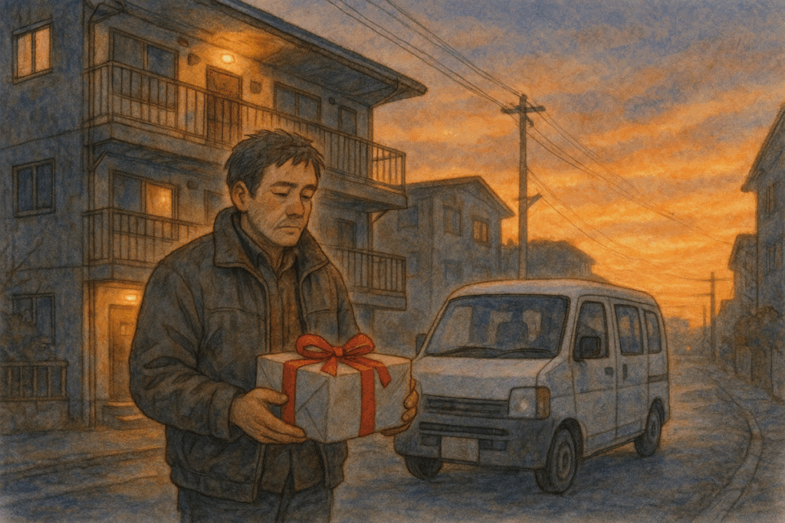
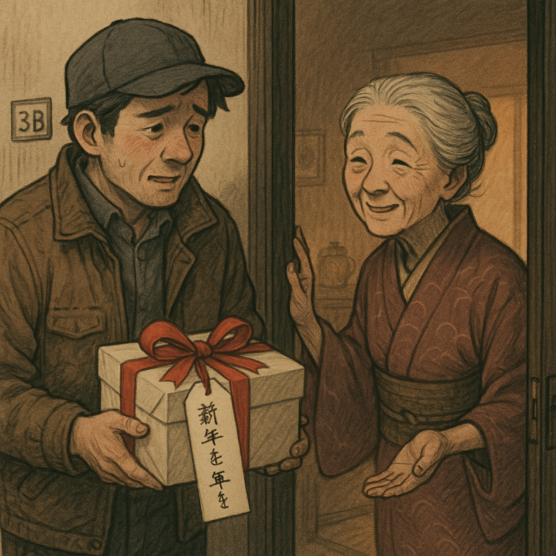
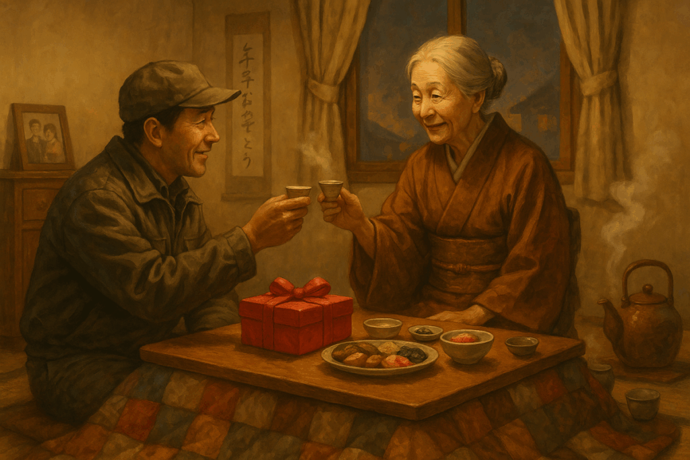
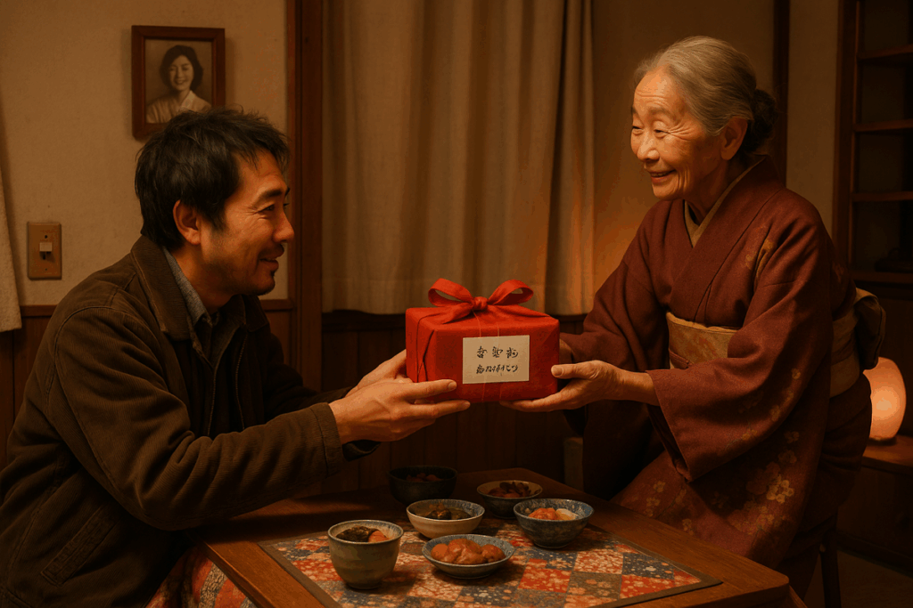

街は沈む夕陽に琥珀色に染まり、大晦日の静かな期待感が漂っていた。配達員の渡辺隆は、年季の入ったジャケットを羽織り、慎重にバンを古びたアパートの前に停めた。手には赤いリボンで丁寧に結ばれた包みを持ち、ラベルには美しい筆跡で「雪子へ　新年おめでとう」と書かれていた。

寒さに震えながら細い階段を上り、3B号室のドアを控えめにノックした。ドアが軋んで開き、色あせた着物をまとった老婦人・雪子が穏やかな笑みを浮かべて迎えた。「寒い中、本当にありがとう」と彼女の声は雪がそっと降り積もるように優しかった。「北海道にいる孫が、毎年欠かさず送ってくれるのよ。」

隆が震える姿を見て、雪子は温かく微笑んだ。「さあ、外にいるのは冷えますよ。中でお茶でも飲んでいきませんか？」隆は迷ったが、その心地よい誘いに引き寄せられるように中へ足を踏み入れた。

室内には木製の写真立て、色鮮やかなパッチワークのこたつ布団、そして煮込み味噌汁の芳しい香りが漂っていた。雪子は気遣いながら隆をこたつへと導いた。

雪子が差し出したお茶の湯気はまるで囁くように立ち上り、隆の心を温かく包んだ。「大したものはありませんが」と彼女は恐縮したように言いながらも、漬物や餅、小さく丁寧に焼かれた魚を並べていった。「今年はこれだけですが、どうぞ。」

会話は最初、慎重に始まった。隆は娘の奈央が自分の生きがいであること、どれほど彼女の笑顔に励まされているかを語った。雪子もまた、亡き夫との大切な日々を懐かしく語り、朝夕の線香が彼女の生活の支えであることを静かに伝えた。

言葉を交わす中で、隆は胸にずっと抱えていた孤独と不安が少しずつ溶けていくのを感じた。雪子が席を外した隙に、目に留まったアルバムを開くと、若き日の彼女が幸せそうに笑っている写真があった。その傍には「幸せは分かち合うもの、一人で抱え込まないで」と書かれていた。

戻ってきた雪子は、小さな杯に酒を注いだ。「新しい年を迎える小さな喜びに、乾杯しましょう」と微笑んだ。静かな部屋に二人の穏やかな笑い声が響き、小さな祝福が心を結びつけた。

別れ際、雪子は小さな手作りのお守りを隆の手にそっと押し付けた。「娘さんにお渡しください。勇気と希望が訪れますように。」

帰路の途中、隆はポケットの中のお守りを指で優しく撫でた。その夜、奈央の枕元に静かに置いたお守りは、二人にとって新たな年の希望と勇気を告げる、ささやかな約束となった。

## **The New Year’s Gift**

The city was bathed in amber light from the setting sun, and a quiet sense of anticipation hung in the air on New Year’s Eve. Takashi Watanabe, a delivery man, parked his van carefully in front of an old apartment building, wearing a well-worn jacket. In his hand was a neatly wrapped package tied with a red ribbon. The label, written in beautiful handwriting, read: _“To Yukiko — Happy New Year.”_

Shivering in the cold, he climbed the narrow stairs and gently knocked on the door of room 3B. The door creaked open, revealing an elderly woman in a faded kimono. Yukiko greeted him with a gentle smile.

“Thank you, truly, for coming in this cold,” she said with a voice as soft as falling snow. “My grandson in Hokkaido sends this every year without fail.”

Seeing Takashi trembling, Yukiko smiled warmly.

“It’s freezing outside. Would you care to come in for a cup of tea?”

He hesitated, but her kind invitation drew him in.

Inside, the room was filled with warmth: a wooden photo frame, a brightly colored patchwork kotatsu blanket, and the savory aroma of simmering miso soup. Yukiko gently guided him to sit at the kotatsu.

As she served tea, the rising steam seemed to whisper softly, gently wrapping around Takashi’s heart.

“It’s not much,” she said humbly, laying out pickles, rice cakes, and a small, perfectly grilled fish.

“But please, enjoy.”

Their conversation began cautiously. Takashi spoke of his daughter, Nao, and how her smile was his reason for living. Yukiko, in turn, fondly recalled her late husband and quietly shared how the morning and evening incense kept her grounded.

As they talked, Takashi felt the loneliness and unease that had long weighed on him start to melt away. When Yukiko stepped out briefly, he noticed a photo album. Inside was a photo of a younger Yukiko, beaming with happiness. Beside it were the words: _“Happiness is meant to be shared — don’t carry it all alone.”_

When Yukiko returned, she poured a little sake into two small cups.

“Let’s toast to the small joys of the coming year,” she said with a smile.

Their gentle laughter echoed in the quiet room, tying their hearts with a small, heartfelt celebration.

As they parted, Yukiko pressed a small handmade charm into Takashi’s hand.

“Please give this to your daughter. May it bring her courage and hope.”

On his way home, Takashi gently rubbed the charm in his pocket. That night, he quietly placed it by Nao’s pillow — a modest promise of hope and courage for the year to come.
