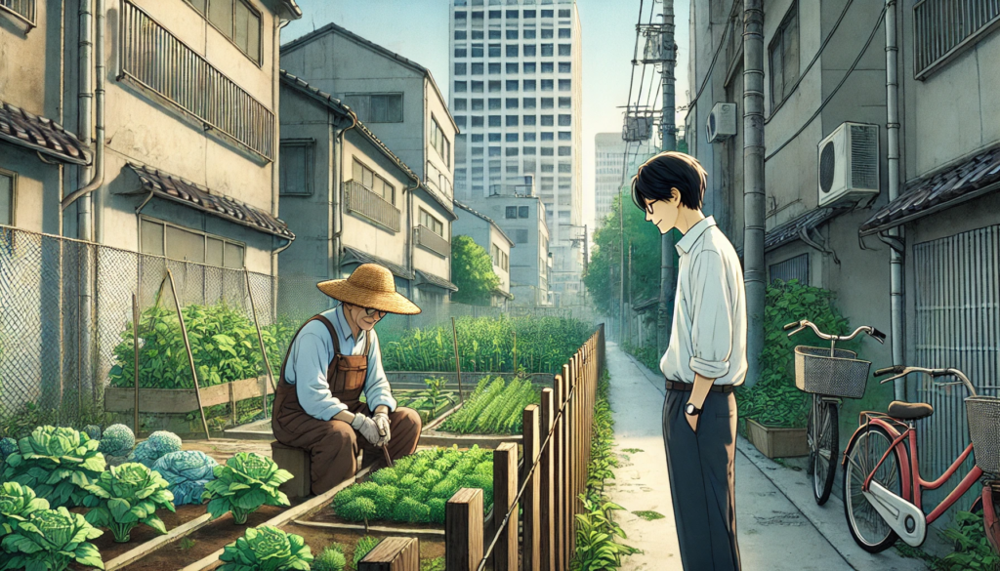
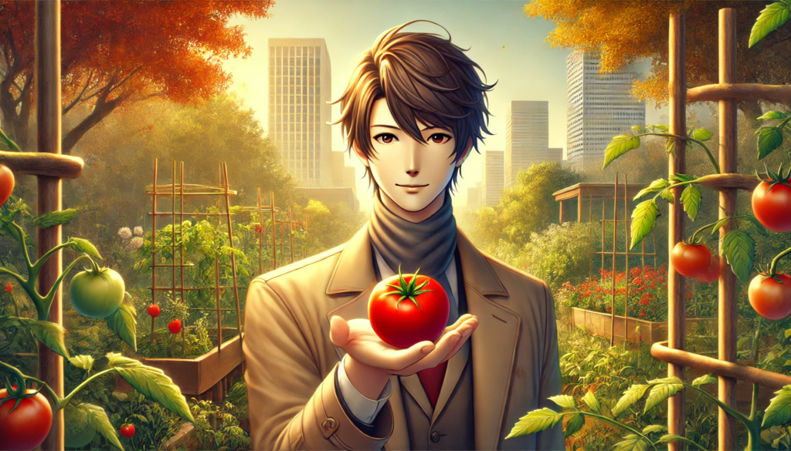

## 都市の鼓動

東京の秋は、街を黄金色に染める銀杏並木と冷たく澄んだ空気に包まれていた。ビルの谷間を抜ける風には、どこか心を落ち着ける静けさと、新しい何かが始まる予感が漂っている。かつて成功者として名を馳せたタツヤ・ハシモトは、自転車のハンドルを握りながら、街の喧騒の中に溶け込んでいた。

その朝、タツヤは自転車をビルの共用駐輪場に止めると、背中のデリバリーバッグを直しながら建物に入った。かつては高級車を駐車場に停め、金融市場を駆け回っていた彼だが、今の生活はすっかり変わっていた。共用オフィスの窓際に立つと、高層ビルが林立する新宿の風景が目に飛び込んできた。窓ガラスに映る自分の姿と、それに重なる都会の景色を見つめながら、タツヤはため息をつく。

「いつか、また胸を張ってここに立てる日が来るだろうか――」そう呟いた彼の瞳には、過去の成功と挫折の記憶が混じっていた。

かつては自信満々で市場を駆け抜けていたが、過信が災いしての失敗はあまりに大きかった。その影響で職を失い、人々の信頼も失った彼は、現在フードデリバリーの仕事をしながら日々を繋いでいる。だが、どこかでまた新たなチャンスが巡ってくるのではないかと、自分を奮い立たせる思いもあった。

夕方、仕事の合間にタツヤはふと足を止め、ある路地裏の都市菜園を見つめていた。そこはビル群に囲まれた場所にある小さな畑で、フェンス越しに様々な野菜が整然と育てられている。畑で作業をする一人の老人が目に留まった。その後も幾度となく通りかかるうちに、タツヤはその老人――森さんに声をかける勇気を持った。

「作物を育てるって、投資に似ていると思いませんか？」唐突な質問に、森さんは一瞬驚いた表情を見せたが、やがて微笑を浮かべた。

「似ている部分はあるかもしれんな。観察力、忍耐、覚悟。どれも必要だ。そして、結果がどうなるか分からなくても、それを受け入れる心もな。」

森さんの言葉は、タツヤの胸に深く響いた。彼は失敗から立ち直る過程で、何か大切なものを見落としていたのかもしれない。

それから数ヶ月、タツヤは週に一度菜園を訪れるようになった。森さんから作物の世話の仕方や土壌の扱い方を学びながら、彼は自分の投資スタイルにも変化をもたらした。かつては短期的な利益を追い求めていたが、今は長期的な成長を重視し、企業の理念や将来性を丁寧に調べるようになった。

ある日、森さんが語った。「畑の土は、どんなに荒れていても、きちんと耕し手を入れれば命を育むことができる。それは人間も同じだ。」

その言葉に触発されたタツヤは、SNSで「育む投資」というテーマの投稿を始めた。彼の経験を共有する中で、次第に注目を集め、企業から新しいプロジェクトへの参加依頼が舞い込むようになった。

プロジェクトでは、若い起業家たちが地元の農家と連携し、新たな価値を創出する試みが行われた。タツヤは金融の知識と森さんの菜園で得た学びを活かし、プロジェクトを成功に導いた。かつての失敗が新たな成長の基盤となった瞬間だった。

秋も深まったある日、タツヤは森さんの菜園を訪れた。フェンスを開けて菜園に入ると、赤く熟したトマトが彼を迎えていた。

「ほら、お前さんが手入れしたおかげで、こんなに立派な実がなったぞ。」森さんは笑顔でトマトを手渡した。

タツヤはその赤い実を見つめながら、小さく頷いた。「これも、一つの育む投資ですね。」

彼の目には、過去の挫折を乗り越えた確信と、未来への希望が宿っていた。

## **後日談：育む未来**

タツヤのSNS投稿やプロジェクトの成功は、多くの人々に影響を与えた。「育む」という理念を共有する仲間たちと共に、彼はさらに新しい挑戦を続けていった。過去の失敗さえも、次の成長を支える「土」となることを、タツヤは心から実感していた。

空が夕焼けに染まる中、タツヤは窓辺に飾ったトマトの鉢植えを見つめた。そこに宿る命の輝きは、彼自身の再生の象徴でもあった。

## **Nurturing Investments: A Story of Renewal**

Autumn in Tokyo bathed the city in the golden hues of ginkgo-lined streets, the crisp, clear air carrying a soothing stillness and the promise of something new. Once celebrated as a financial success, Tatsuya Hashimoto now gripped the handlebars of his bicycle, blending into the bustling urban rhythm around him.

That morning, Tatsuya parked his bicycle in the communal rack of a building and adjusted the delivery bag on his back as he entered. Once a man who parked luxury cars and thrived in the fast-paced financial markets, his life had drastically changed. Standing by the window of a shared office, he gazed at Shinjuku’s skyline of towering buildings. His reflection overlapped with the sprawling urban landscape beyond the glass, and a sigh escaped his lips.

“Will there ever be a day when I can stand here with pride again?” he murmured, memories of past triumphs and failures mingling in his eyes.

Back then, Tatsuya exuded confidence as he navigated the markets, but his overconfidence led to a devastating failure. The aftermath left him jobless, stripped of trust from those around him. Now, working as a food delivery courier, he lived day to day, clinging to the faint hope that a new opportunity might eventually come his way.

One evening, during a lull in his deliveries, Tatsuya stopped in his tracks, drawn to a small urban farm tucked behind a row of skyscrapers. The neatly cultivated vegetables within the fenced plot intrigued him, as did the sight of an elderly man tending to the soil. Over time, Tatsuya found himself pausing more frequently, until one day, he mustered the courage to speak to the man—Mori-san.

“Do you think nurturing crops is like investing?” Tatsuya asked abruptly.

The question startled Mori-san, but a smile soon spread across his face. “In some ways, yes. It takes observation, patience, and a willingness to accept outcomes beyond your control,” he replied.

Those words resonated deeply with Tatsuya. As he grappled with the aftermath of his failures, he realized he had overlooked something essential in his path to recovery.

Over the following months, Tatsuya began visiting the farm weekly. Under Mori-san’s guidance, he learned the nuances of caring for crops and preparing soil. The lessons extended beyond the farm, influencing Tatsuya’s approach to investing. No longer chasing short-term gains, he started focusing on companies with strong values and long-term potential, meticulously researching their foundations.

One day, Mori-san shared a profound thought: “No matter how barren the soil may seem, if you till it with care and effort, it can sustain life. People are much the same.”

Inspired by these words, Tatsuya began sharing his insights on social media, writing under the theme of “Nurturing Investments.” His posts gained traction, eventually catching the attention of businesses that invited him to collaborate on new projects.

One such project involved young entrepreneurs partnering with local farmers to create new value. Tatsuya combined his financial expertise with the practical lessons he had learned on Mori-san’s farm, helping steer the project to success. It was a turning point where his past mistakes became the foundation for future growth.

As autumn deepened, Tatsuya returned to the farm one day. Pushing open the fence, he was greeted by the sight of ripe, red tomatoes shining in the sun.

“Look at this,” Mori-san said, handing him a tomato with a smile. “Thanks to your care, we’ve grown something magnificent.”

Tatsuya gazed at the fruit, a symbol of their collective effort, and nodded softly. “This, too, is a kind of investment—one that nurtures,” he said.

His eyes held a newfound certainty, a resolve born from overcoming setbacks and embracing a hopeful future.

**Epilogue: Cultivating the Future**

Tatsuya’s social media posts and project successes inspired many, building a network of like-minded individuals who embraced the philosophy of “nurturing.” Continuing to embark on new challenges, he realized that even past failures could serve as the “soil” for future growth.

As the sky turned shades of orange and pink at sunset, Tatsuya looked at the tomato plant on his windowsill. The vibrant fruit symbolized life’s resilience—a reflection of his own journey toward renewal.
