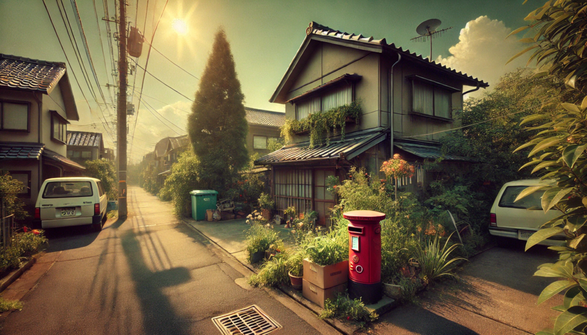
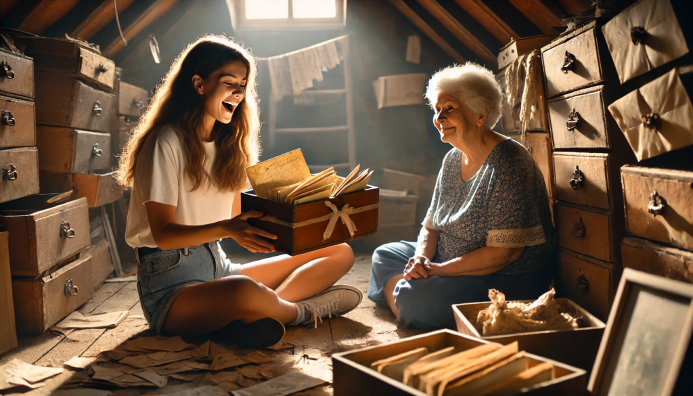
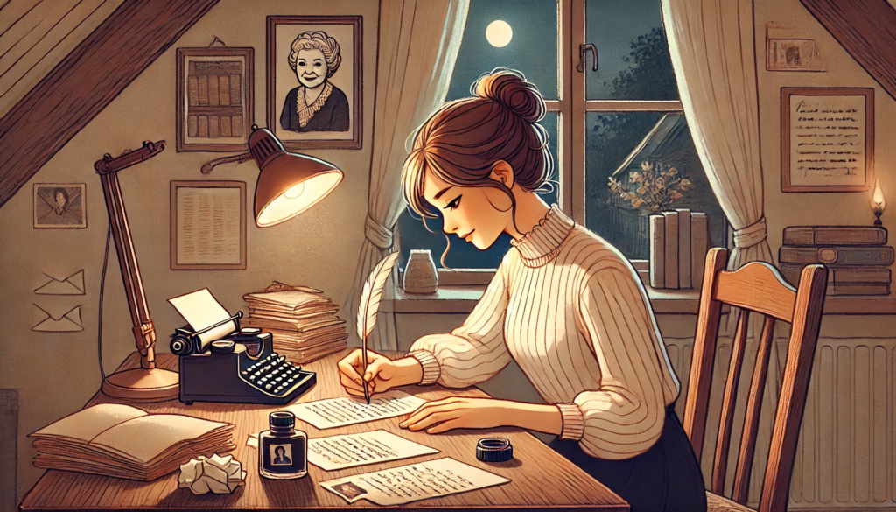
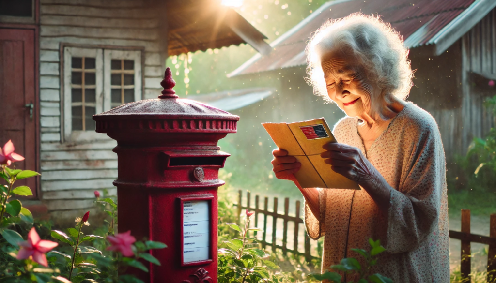

  
真夏の強い日差しが東京郊外を包み込み、白く輝くアスファルトの上で陽炎が揺れていた。庭先では風鈴が涼しげに鳴り、遠くから聞こえる蝉の声が暑さをさらに際立たせる。鈴木春子が暮らす築50年以上の古びた家は、周囲の住宅街の中で忘れ去られたようにひっそりと佇んでいた。その庭の隅には、地面に少し傾いた赤いポストが錆びつき、雑草に埋もれそうになっていた。

その日は春子の孫、美咲が久々に訪れていた。大学生の美咲は、活発な性格で、Tシャツとショートパンツという軽装で猛暑の中も元気に動き回る。対する春子は72歳。物静かで穏やかな表情をたたえつつも、長い人生で培われた強さが滲み出ている。

「おばあちゃん、この赤いポストって何？」

美咲が指差した錆びたポストに目を留める。インターネットとスマートフォンが普及した時代に育った美咲にとって、郵便ポストは馴染みのない存在だ。

「昔はね、手紙を送るために使ったものなのよ」と春子は懐かしげに微笑む。「このポストに手紙を入れると郵便屋さんが集めてくれて、何日かして相手の家に届くの」

美咲はその説明を聞き、目を輝かせる。「手書きの手紙って、メールとは全然違うね」

こうして二人の会話が続く中、錆びた赤いポストは、かつて家族や友人を繋げていたその役割を再び思い出させてくれた。

**屋根裏の宝物**

午後の陽が傾き、二人は古い屋根裏部屋を片付け始めた。埃が積もった小さな部屋には、長年手つかずだった段ボールが積まれている。その中に美咲が興味津々で見つけたのは、傷だらけの木箱だった。箱を開けると、中には手紙がぎっしり詰まっていた。薄い便箋には、今でも香水の匂いがわずかに残っている。

「これ全部手紙なの？」

美咲が興奮気味に尋ねると、春子は微笑んで頷いた。「若い頃に友達と交わした手紙よ。それから、これはね……おじいちゃんからのラブレター」

春子が手渡した手紙には、亡き夫・一郎が若き日に書いた愛情あふれる言葉が綴られていた。

美咲は手紙を丁寧に開き、一文字一文字を目で追う。スマホのメッセージにはない手書き文字の温かさが、美咲の心を深く揺さぶった。

**ポストに込められた想い**

その夜、美咲は生まれて初めて手紙を書くことを決心した。慣れない手でペンを握り、何度も書き直しながら、祖母への感謝の気持ちを綴っていく。「いつも支えてくれてありがとう」「あなたから学んだ優しさを、私も誰かに伝えたい」。美咲は一文字一文字に心を込めた。

翌朝、春子が庭に出ると、錆びたポストの蓋が少し開いていた。中を覗くと、美咲からの手紙が入っている。春子は震える手で封を開き、便箋を読み進める。「おばあちゃんへ。あなたが教えてくれた手紙の素晴らしさを感じて、私も書いてみました。これからも手紙で気持ちを伝え合いましょうね」。

春子の目には涙が浮かんでいた。それは、懐かしさと喜びが入り混じった温かな涙だった。そして、その日から錆びた赤いポストは、再び家族の想いを繋ぐ象徴として生まれ変わった。

## **The Tale of a Rusted Postbox: Threads of Connection**

**The Tale of a Rusted Postbox: Threads of Connection**

The scorching summer sun enveloped the suburbs of Tokyo, making the asphalt shimmer under the heat haze. A faint chime from a wind chime hanging by the eaves added a touch of coolness to the relentless heat, while the distant hum of cicadas made the season’s presence unmistakable. In the midst of a residential neighborhood stood an aging house, over fifty years old, appearing forgotten amidst the modern surroundings. In a corner of its garden, a rusted red postbox leaned slightly, half-consumed by encroaching weeds.

On that day, Haruko Suzuki’s granddaughter, Misaki, paid a rare visit. A university student, Misaki was full of energy, darting about in a T-shirt and shorts despite the sweltering heat. Haruko, 72, carried a serene demeanor. Her gentle expression belied the quiet strength she had gained through decades of life.

“Grandma, what’s this red postbox?”

Misaki pointed to the rusted relic with curiosity. Having grown up in a world dominated by the internet and smartphones, Misaki found a physical mailbox to be an unfamiliar sight.

“It used to be for sending letters,” Haruko replied with a nostalgic smile. “You’d drop your letter in here, and the postman would collect it. It might take a few days, but eventually, it would reach its destination.”

Hearing this, Misaki’s eyes lit up. “Writing letters by hand must feel completely different from sending an email.”

As the conversation continued, the rusted red postbox seemed to stir with the memories of its past role, once connecting family and friends across distances.

**Treasures in the Attic**

As the afternoon sun began to wane, the two of them started cleaning out the old attic. It was a small, dusty space filled with boxes that had remained untouched for years. Among the piles, Misaki’s curiosity was piqued by a battered wooden box. Carefully opening it, she discovered it was packed with letters. The delicate paper still faintly carried the scent of perfume.

“Are these all letters?”

Misaki asked excitedly, and Haruko nodded with a tender smile. “They’re letters I exchanged with friends when I was younger. And this one…” she paused, “is a love letter from your late grandfather.”

The letter Haruko handed Misaki was filled with heartfelt words from Ichiro, her late husband, penned during his youth.

Misaki carefully unfolded the letter, her eyes tracing each word. Unlike the brevity of a smartphone message, the warmth of handwritten words touched her deeply.

**A Letter’s Message**

That evening, Misaki made a decision—she would write a letter for the first time. Clumsily holding a pen, she rewrote her message several times, each iteration brimming with her gratitude to her grandmother. “Thank you for always supporting me,” she wrote. “The kindness I’ve learned from you, I want to pass on to someone else.” With each stroke, Misaki poured her heart onto the paper.

The next morning, as Haruko stepped into the garden, she noticed the lid of the rusted postbox was slightly ajar. Peeking inside, she found a letter from Misaki. With trembling hands, she opened the envelope and began to read the heartfelt words.

“To Grandma,

You’ve shown me the beauty of writing letters, and I wanted to try it myself. Thank you for your kindness. Let’s continue to share our feelings through letters.”

Tears welled up in Haruko’s eyes—tears of nostalgia and joy mingled with gratitude. From that day forward, the rusted red postbox was reborn, once again a symbol of the connections that bound their family together.
