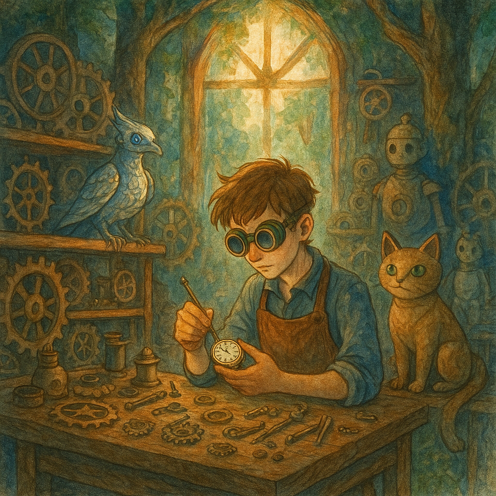
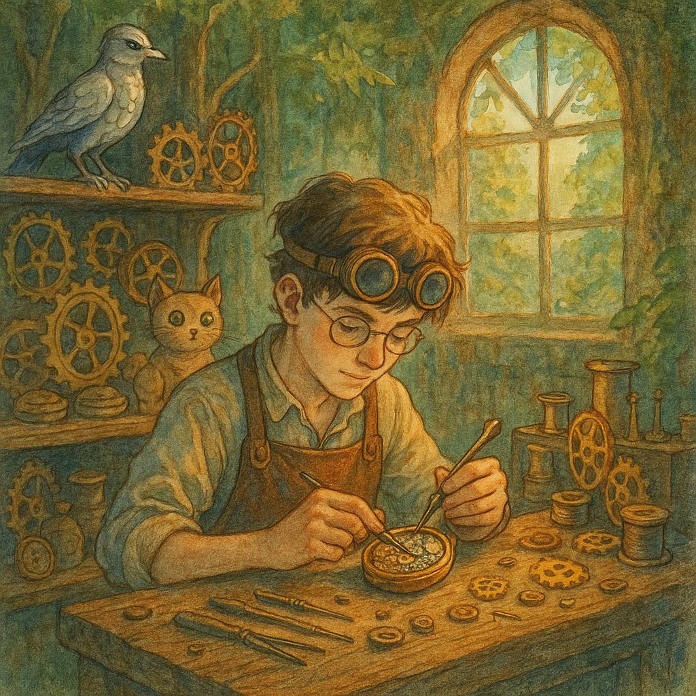

## 第1章　松の間を行く歯車

ルニスの森――百年松が古びた鐘のようにささやき、苔の下に埋もれた歯車が錆を浮かべるその奥で、十七歳のレンは片眼鏡を目に当てていた。作業台に開かれた懐中時計は、今にも逃げ出しそうに秒針を震わせている。レンは杉樹脂とランプ油の馥郁たる匂いを吸い込み、睫毛より細い真鍮の歯の間へピンセットを滑らせた。  
チッ――カチリ。 テンプが静まる。 またひとつ、静寂から救い出した。  
時計をベルベットの袋に収め、コリン師匠の帳簿に端正な字で修理完了を記す。向かいの丸椅子は空のまま。師匠は夜明け前に月例の物々交換へ出かけ、店番はレンに任された。年老いた男のしゃがれた鼻歌がないだけで、工房の静けさはひと際重かった。  
高窓から午後の光が差し込み、眠ったままのオートマタの列に落ちる。嘴の欠けた銀の歌鳥、尾を振らぬ木製の猫、兜の半分を失った騎士。レンは夜になると彼らが目を覚まし、歯車が蔑まれる前の昔話を交わすのだと想像することがあった。  
指先の金屑を払う。こめかみの奥が——いつものように——失われた記憶の形を疼かせた。暗闇、火花、煙から引き上げる手。そこから先は真白。レンは息を吐き、痛みを追い払う。  
――ドンッ。  
鎧戸が震えた。  
レンは身を強ばらせ、短剣代わりの重いドライバーを掴む。もう一度、しかし小さめの衝撃。静寂。そっと扉を開け、外を覗く。  
シダの茂る空き地に、少女がうつ伏せに倒れていた。  
象牙色だったはずの外套は泥に汚れ、片方の靴は脱げている。楓を思わせる赤褐色の巻き髪が肩に広がり、脇の革鞄からは巻物が散らばり、ほの青い光が漏れていた。  
――誰かがこんな奥まで？  
レンの鼓動が速まる。村人でさえ「時計職人の幽霊」を恐れ滅多に来ない場所、ましてや見知らぬ者など。  
「聞こえる？」しゃがみ込み、首筋に指を当てる。早いが確かな脈。  
彼女を背負い上げると、巻物が転がり、ちらりと覗いた図面——それは亡き父のノートにある禁断の機械獣と同じ筆致だった。  
ぞくり、と背筋が粟立つ。  
工房の簡易寝台に少女を横たえ、額の浅い傷を湿布で拭う。間近で見ると十八、十九か。鋭い輪郭を疲労が和らげている。瞼が震え、煙と川石を混ぜたような瞳がレンを捉えた。  
「ここは……？」掠れた声。  
「ルニス。僕の工房の前で倒れてた。」  
動揺が走り、少女は身を起こしかけて脇腹を押さえた。「追っ手……収集家の兵が……来なかった？」  
「誰も見ていない。」  
安堵とも焦燥ともつかぬ息を吐き、彼女はレンを観察するように見つめた。「あなたがレン。違う？」  
「どうして僕の名を？」  
「時計を直す名手がいると聞けば、村人は皆その話をするわ。」  
頬が熱くなる。「君は？」  
「エリア。学者よ——少なくとも二週前までは。」  
レンは腕を組む。「学者は禁図を抱えて森で倒れたりしない。」  
図星を突かれ、エリアの目が険しくなる。「巻物が転がったのよ。」  
壁掛け時計のゆるやかなチクタク。外では風鈴代わりの歯車が鳴り、間を計る。  
やがてエリアは囁いた。「その図面は危険。でも王国を救う切札にもなり得る。収集家は戦機械を蘇らせようとする。私はそれを封印したい。……あなたの師は昔、その機械と戦ったのでしょう？」  
レンの胸で歯車が空回りする。コリンは過去に触れたがらなかったが、鍵の掛かった戸棚には錆びた鍵束と怯えの影があった。  
「師匠に連絡する。」レンは鳩形の使いオートマトンに文を託し、夜の森へ放つ。  
雨が降り始める。エリアは眠りに落ち、胸元で砕けた水晶のペンダントが淡く光る。  
レンは机に向かい、紙を引き寄せた。記憶の底から呼び覚ました守護機械の輪郭を——戦いではなく守るための心臓を持つ存在を——描き始める。  
雨滴が時を刻んだ。

## 第2章　真鍮にひびく残響

夜明けの光が薄く屋根裏の窓から差し込み、ケトルの湯気のように揺れていた。伝書オートマトンのフィンチは戻らず、レンの神経を狂ったアンクル錘のようにつついた。エリアは毛布にくるまり、手のひらほどの歯車の溝をなぞっている。  
「これ、あなたが直したの？」 レンは頷き、ガラス越しに木立を見やった。「音楽箱が自壊した残骸から。」  
エリアの口元がかすかに笑む。「あなたは機械以上のものを直してるわね。」  
返事しかけた瞬間、店の鐘が甲高く鳴り、工具が揺れた。扉が叩きつけられるように開き、雨でずぶ濡れのコリン師匠が飛び込んだ。腕にはフィンチがしがみつき、歯車をきしらせている。  
「坊主、今度はどんな厄介ごとだ！」 フィンチは力尽きて崩れ、バネが空回りした。  
「師匠、彼女が助けを――」 だがコリンの視線はエリア、棚の設計図へと移り、レンへ戻った。「これが何か分かっているのか？」  
エリアが立ち上がる。「ルーパイン・ヴァンガードの設計図です。十七行目にあなたの署名。」  
老職人の顔から血の気が引く。剥げた真鍮のごとく蒼白だ。「全部燃やしたはずだ。」  
「全部ではありません。」エリアの声は低い。「王室の書庫に一部残り、収集家が奪いました。」  
レンが割って入る。「収集家って誰なんです？」  
「アラリック・ヴェン。かつて城塞時計を設計した天才だ。」コリンは吐き捨てた。「戦機械が禁じられると部品を持ち逃げし、恨みを募らせた。」  
エリアは巻物を広げ、機械狼を示す。「彼はこれを群れで復活させるつもり。私は足止めしたかった。」  
遠雷のような轟きが森を震わせた。空は晴れている。  
コリンは鍵を取り出し、戸棚を開けた。ベルベットの箱に異質な懐中時計——水晶の主ゼンマイが蒼光を脈打つ。  
「二度と巻かぬと誓ったが、お前なら。」 レンの手に押し込まれる。「未完成のオートマタに繋げば心臓になる。」  
「父さんと作った？」 「……ああ。それで彼は全てを失った。」  
次の轟音。鉄が軋む悲鳴。窓外、松の間を巨大な狼型機械が踏み進む。未完成でも禁断の火花を孕んでいた。  
「見つかったわ。」エリアの顔色が消える。  
村の広場が脳裏に浮かぶ。祭のリボン、灯籠……。 「師匠、部品室を。」 「好きに使え。私は村人を洞窟へ導く。エリア――」 「私はレンと行く。」  
コリンは短く頷いた。「最初の歯車が動く時だ。」  
⸻  
雑然とした納屋。レンは真鍮の脊椎、鋼の腱、調整器を収める心籠を並べた。屋根を叩くのは雨ではない。鉄狼の足音だ。  
エリアは袖をまくり、符丁を刻む。「どこを溶接する？」  
言葉なく動く二人。レンが軸を揃え、エリアが封緘のルーンを焼き付ける。守護者の骨格が形を取り、銅の羽を纏う鷹へと変わった。  
調整器を胸に装填。世界が止まり——ウィルン。蒼い光が走り、翼が刀の抜けるように鳴った。  
外で狼が咆哮する。真鍮に鍛えられた反響。  
レンはエリアと視線を結ぶ。「行こうか。」  
「歴史を上書きしましょ。」  
扉が開放され、松風と樹脂の匂いが流れ込む。少年と学者、そして生まれたばかりの守護鷹が、収集家の最初の魔獣を迎え撃つ。  
レンの懐で時計が刻む。過去と未来を隔てる鼓動のように、毅然と。

## 第3章　歯車と爪の衝突

守護の鷹は銅の彗星のように工房を飛び立った。折りたたまれていたピニオンが一気に三メートルの翼へと展開し、バネの衝突音が森に響く。レンはその影の下を走り、エリアが並走した。濡れた苔が靴底でぬかるみ、前方では鉄の狼が甲高い汽笛のような遠吠えをあげる。  
木々を抜けると、村の広場が時計盤のように開けた。石造りの噴水が数字、街灯が針。祭りの赤と金のリボンが屋根と屋根を結び、迫る破滅の風に震えていた。コリン師匠は村人を石灰岩の洞窟へ誘導し、鐘より遠くまで届く声で指示を飛ばしている。  
狼が姿を現した。  
荷馬車より背が高いが痩せ、合金の肋骨が露出していた。隙間で揺れるコバルトの炎は、不安定な魔力が違法の符で縛られている証。前脚が木の荷車を踏み砕き、破片が散った。機械の頭部が回転し、シャッター状のレンズが広場を舐め、レンで止まる。  
胸の奥で幼児の恐怖が爆ぜた。六歳の自分、煙にむせび、火花を引く金属の猟犬。誰かの腕に引きずられる記憶。歯車が欠けるように視界が揺れ、膝が折れそうになる。  
エリアが肩を掴んだ。「吸って、吐いて。」一呼吸、二呼吸。震えが引いた。  
頭上で鷹が旋回し、指令を待つ。レンは調整時計を掲げた。水晶の主ゼンマイが淡く輝き、機械の心臓と共振する。鷹の〈守りたい〉という衝動が指先に伝わった。  
護る。 そう念じ、鷹は翼を畳んで急降下。  
青銅の爪が鋼の吻に食い込み、錆びた装甲に深い溝を刻む。狼が跳ね上がり、噛みつこうとする刹那、鷹は身を翻し排気口を切り裂き、青い炎を吹き出させた。洞窟の村人たちは悲鳴と歓声を半々に上げる。  
狼が再構築する。ギアが離脱し、再噛合し、後肢がピストンのように揺れる。跳躍——人ひとり半を飲み込める顎。レンはベゼルを左へ弾き〈回避〉を命じた。鷹は空高く跳ね上がり、狼は噴水へ突っ込む。大理石が砕け、水が魔力火に触れて蒸気が立ちこめた。  
エリアが濡れた石畳に巻物を広げ、低い詠唱を始める。「中枢の符を弱めるわ。装甲を剥がして！」  
「剥がそう。」レンはベゼルを回し、鷹の翼端から鋸刃が展開。再び背を掠める弧を描き、火花と金屑の尾が伸びる。  
狼が仰け反り、胸の装甲が裂けた。符を刻んだロッドに抱えられ、渦巻く青い心臓——収集家の印。  
エリアの詠唱が鋭さを増し、符が線ごとに崩れる。狼は対抗して尾を蠍の針のように曲げ、鷹へワイヤー銛を射出。翼の支柱が貫かれ、青銅の羽が雨のように散った。  
「耐えてくれ。」レンは調整器を巻き上げ、バネが悲鳴を上げる。  
彼は走った。蒸気の霞む視界を突き、狼の巨体下へ滑り込み、整備用の継ぎ目に骸骨鍵を差し込んで捻る。  
装甲が花弁のように剥がれ落ちる。  
「今よ！」エリアが叫ぶ。  
最後の呪文が心臓を縛る符を砕く。青炎が剥き出し。狼の肢が痙攣する。レンは鉄製ドライバーを核心へ突き立てた。シューッという音とともに光がコバルトから灰色へ褪せ、鉄獣は一度大きく震え——崩れた。ギアが種子のように散らばる。  
静寂が戦いよりも大きく響いた。  
小雨が静かに戻り、煤を側溝へ流す。鷹は壊れたシャーシに着地し、片翼を痛めつつも堂々と佇む。レンはその胸板に手を置いた。「ありがとう。」聞こえぬ機械へ囁く。  
洞窟から歓声が遅れて湧き、コリンが駆け寄った。「見事だ、坊主……いやレン。そして学者殿。」長い年月を映す頷きがエリアへ向けられる。  
だがエリアは残骸に膝をつき、狼の首から親指ほどの真鍮筒を外した。封を割ると、水晶スピンドルが現れ、微かな脈動とともに声が響く。蜘蛛糸のようなアラリック・ヴェンの声。  
「試作機、送信完了。受信装置へ報告。座標待機：ヴェラース時計塔遺跡。」  
録音が途切れる。エリアは肩をこわばらせた。「奴はここにいなかった。影と戦っただけ。」  
コリンが悪態を吐く。「なら本隊はまだ鍛造中だ。」  
レンは雨と恐怖で濡れた村人の顔を見渡す。子どもたちが途中のリボンを握りしめている。彼は水晶片を拳で包んだ。「待てば記憶だけじゃなく村も焼かれる。」  
エリアと視線が合い、同じ決意と同じ震えを読み取った。「ヴェラースは東へ四日。古い鉄道跡が続いている。」  
コリンは顎を動かした。「私は村の守りを固める。だが……お前たちが前へ進め。」  
調整時計が脈打ち、次の刻を待つ。  
鷹は翼を畳み霧へ続く森路を見つめる。レンはそっと呟いた。「次の歯車を動かそう。」

## 第4章　忘れ火花のレール

夜明けの靄が鉄狼の残骸を冷めゆく息のように包んでいた。レンは守護鷹の損傷した翼に新しい真鍮ピニオンを締め込み、銅の羽根がシャリッと音を立てて揃う。  
「名前を付けようか。」エリアがグリース布を渡す。  
名付けは絆を意味する――逡巡ののち、レンは囁いた。「アウレル。光っていたから。」  
ガラスの双眸が満足げに瞬いた。  
コリン師匠が寝具と杜松パンの乾物、携帯鍛造キットを抱えて現れた。「古い木製レールを辿れ。」北東へ消える二本の軌条を指す。「側線に足踏みハンドカーが残っとる。登りは脚で漕げ。」  
彼は銅円盤をレンの掌に置いた。師匠の刻印入りの親歯車。「ヴェラース塔の工房錠前を開ける鍵だ。お前の父が預けたもの、返す時が来た。」  
胸に熱が広がる。「必ず持ち帰ります。」  
「帰るのは鍵よりお前ら自身だ。」  
⸻  
蔦に呑まれたハンドカーはポンプアームまで苔に覆われていた。アウレルは後部手すりに止まり、エリアは水晶スピンドルを護符袋に収める。  
「座標はこれに刻まれてる。だがヴェンも進路を解読してるかも。」  
レンがポンプを押すと、車輪は錆を散らして転がり、樹々が翡翠の回廊を開いた。朝陽が途切れ途切れに点滅する灯火のように差し込む。  
カーブごとに現れる錆びたマイルポスト――それぞれ異なる時刻で凍った時計盤。レンが指で触れると、熱い金属とライラック油の匂いが蘇り、父が旋盤の横で笑いながら歯車を回す幻が一瞬閃いた。  
「痛む？」エリアが尋ねる。  
「知らないほうが、もっと痛い。」レンは腕を動かし続けた。  
⸻  
正午、線路は古い高架橋へ。谷底には貨物機関車の骸が横たわり、貨車は裂けていた。ボロ外套の掘り子たちが回路を剥ぎ、黒旗の街灯が野営地の印。  
ハンドカー急停。アウレルが蒸気を噴き、爪を構える。槍を掲げた掘り子は五人。  
「落ち着け！」銀ゴーグルの女頭が叫ぶ。「殺り合う気はない――先に手を出さなきゃな。」  
エリアが先に降り、手を見せる。「ヴェラース塔へ向かう。道中の噂は？」  
「山ほどさ。」女は鷹を舐めるように見る。「青火の隊商が二夜前に東へ。箱には収集家の渦巻。谷の塔は稲妻を噴いてる。」  
レンは細線コイルと時計油を差し出し、乾果と崩れたトンネルを避ける分岐地図を得た。女――マーロ――はゴーグルを押し上げる。「気をつけろ歯車坊。ヴェンの新しい猟犬は二本脚で、人のように考える。」  
言葉が背中を冷やした。  
⸻  
黄昏、空が真鍮と菫に染まる頃、折れた高架の向こうで幕営。エリアが符で焚火を起こし、レンはアウレルの翼を仕上げた。  
杜松パンをかじりながらエリアは打ち明ける。「ただの学者じゃない。禁書設計を記録する学院の見習いだった。図面を盗まれたのは……私が保存したせい。」炎が悔恨を映す。「知識は守れば善だと思った。」  
レンは調整時計を二人の間に置く。「知識は歯車――どの軸を回すかは選べる。」微笑を返す。「正しい歯車を噛ませよう。」  
星冷える夜、レンは夢を見る。作業台の下で小さな自分。爆音。父の声が囁く。\*心臓を守れ、レン。約束だ。\*壁が燃えて崩れ、夢はそこで千切れた。  
黎明前、アウレルの低い駆動音で目覚める。東の地平に稲妻が脈打ち、鋸歯の塔――ヴェラース時計塔の影。その轟きは嵐ではなく機械の鼓動。  
エリアが背負い袋を締める。「二日目ね。」  
レンはペダルに足を掛けた。アウレルは修復された翼を広げる。次の歯車が待っていた。

## 第5章　時計塔の鼓動

三度目の夜明けがレールを震わせる金属雷で迎えた。前方、軌道はリベットだらけの鉄橋で渓谷を跳び、向こう岸にヴェラース時計塔が谷を支配していた。真鍮と黒石の棟に青い稲光が這い、雲を亡霊の炎で染める。  
アウレルが上空で偵察の弧を描く。そのたびに調整時計へ微かな脈波が伝わり、レンの骨まで安心を届けた。  
「最後の区間だ。」レンは息を切らしポンプを押す。「中枢を壊してヴェンが来る前に決着を。」  
「すでに目覚めているなら尚更急いで。」エリアが外套を締めた。  
⸻

### 二足の猟犬

鉄橋の中ほどで甲高い警笛。崩れた貨車の陰から姿を現したのは、犬の名を持ちながら人のように歩く狩猟機械。青を帯びたアンテナが肩で火花を散らす。  
アウレルが警告を叫び、レンはブレーキを踏み込む。ハンドカーが火花を弾き停止。猟犬は蜘蛛のように梁を駆け上がる。  
「狼と同じ中枢なら通気結合を狙うわ。」エリアが走り書きを示す。  
レンが頷き、調整器を弾いた。鷹が急降下し、最初の猟犬のアンテナを断ち落とす。だが二体が車上に跳び乗り、刃肢がレンの腕を切り裂いた。時計が血塗れの指から滑りかける。  
膝を突き出し甲板で敵の関節を折り、エリアが符焔のコテを突き刺す。蒸気と魔力が爆ぜ、機械は沈黙。もう一体がエリアに跳ぶが、レンは親歯車でレンズを砕き、アウレルが止めを刺した。  
沈黙。エリアが包帯を締めながら震える声で言う。「また袖が血まみれ。」  
「いつものことさ。」レンは痛みに顔をしかめた。「橋は空いた。行こう。」  
⸻

### 静止した歯車の街

ヴェラースの街路は煤と錆に覆われ、ランプ柱にもたれたオートマタが案山子のようだ。時計表の欠片が散る看板に、途切れた時刻表が点滅する。  
塔の付け根からは樹幹ほどのケーブルが下水へ潜り、見えぬ源から力を盗んで脈打っていた。  
サービス入口の青銅ハッチに刻まれた印章――コリンの歯車と対になる。円盤が回り、重い扉が嘆息する。  
内部は巨大な空洞。解体された砲塔部品が骨の山のように積まれ、天井の青い導管が脈打つたび床が震えた。  
螺旋リフトを登る途中、壁に浮かぶホログリフが狼群の配線図を映し出す。中央に示された〈動脈エンジン〉――そこに＊規制器キー要求＊の空洞。  
エリアが呟く。「あなたの時計を奴に渡せば完成する。」  
「だから先に壊す。」

## 第6章　鼓動を止める手

ヴェラース時計塔の螺旋階段を登るごとに、レンの手の中の調整時計が青く脈を打った。鼓動のたびに、床下の“動脈エンジン”が重々しく応え、まるで巨大な獣の心臓のように鼓動している。  
「レン、もうすぐ制御室よ。」  
エリアの声に、彼は頷く。錆とオゾンの匂いが混ざる空間、次の角を曲がった先に、蒼光に包まれた中央制御核が姿を現した。  
だが、そこに立っていたのは人間だった。  
「やあ、少年。」  
男はマントを翻し、やつれた顔に笑みを浮かべていた。アラリック・ヴェン。彼の背後では、動脈エンジンに接続された無数の管が脈打ち、まるで意思を持っているようにうごめいている。  
「私の設計を破ったか……だが、来ると思っていたよ。コリンの弟子にして、ヴァンガードの心臓を持つ少年。」  
レンは時計を握る。「もう止めろ。これは——」  
「これは、進歩だ。」ヴェンが言葉を遮った。「文明は破壊から始まる。過去の遺産は、新しい秩序の礎になるべきだ。」  
「破壊じゃなく、継承の道もあるはずだ。」  
エリアが前に出る。「あの狼も、あの猟犬も、あなたの影にすぎなかった。でも人の心までは模倣できない。」  
ヴェンは眉を寄せ、笑みを失った。「ならば証明してみろ。」

そのとき、制御核の脇の扉が開いた。  
「遅れてごめんなさい！こっちの山路で煙を見て……」  
現れたのは、背中に折りたたみ風力発電機を背負った少女だった。ボサボサの髪に泥の跳ねた顔——アミ・ヨシダ。環境保護活動で時計塔の地下構造を調査していた彼女は、蒼い稲妻に導かれるようにやってきた。  
「ヴェンを止める方法があるわ！」アミは小さな水晶球を掲げた。「この古代記録装置、地下で見つけたの。塔の最初の建築者が、動脈エンジンに“最後の安全機構”を残してたの。」  
「それを——」エリアが瞳を見開く。「今使える？」  
アミは頷き、鞄から装置を取り出し、管の一つに接続した。すぐに空気が変わる。ヴェンが叫ぶ。「やめろ、それにアクセスすれば——！」

だがもう遅い。

制御室全体が青から白へと色を変え、エンジンが震えを止めた。心臓が息を止めたように。  
ヴェンが膝をつき、呻く。「……こんな、終わり方……」  
「まだ、終わってない。」レンは彼の前に立ち、落とした懐中時計を拾って差し出した。「あなたもかつては守りたかったんでしょう。なら……これで終わらせるべきじゃない。」  
アラリック・ヴェンは、震える手でそれを受け取り、沈黙のなかに視線を落とした。

## エピローグ：星を継ぐ工房

数週間後、ヴェラース時計塔は封鎖され、地下の記録は公文書館に保管された。

ルニスの森では、工房の屋根が修繕され、アウレルは新たな銅の翼を得て、村の子どもたちの憧れとなっていた。

レンとエリアは、塔で得た古代技術を安全な形で記録し、アミと共に新しい学術機関「時の継ぎ手協会」を設立した。そこでは、機械技術と記憶、そして“継承”の方法が教えられた。

ある日、工房の裏庭で、アウレルが空を飛び、エリアが巻物に記す。

「ねえレン、これからも……たくさんの歯車を回していくんだよね。」

彼は笑って答えた。

「もちろん。そのために僕らはここにいるんだから。」

歯車は回り続ける。過去を刻み、未来を紡ぐために。
