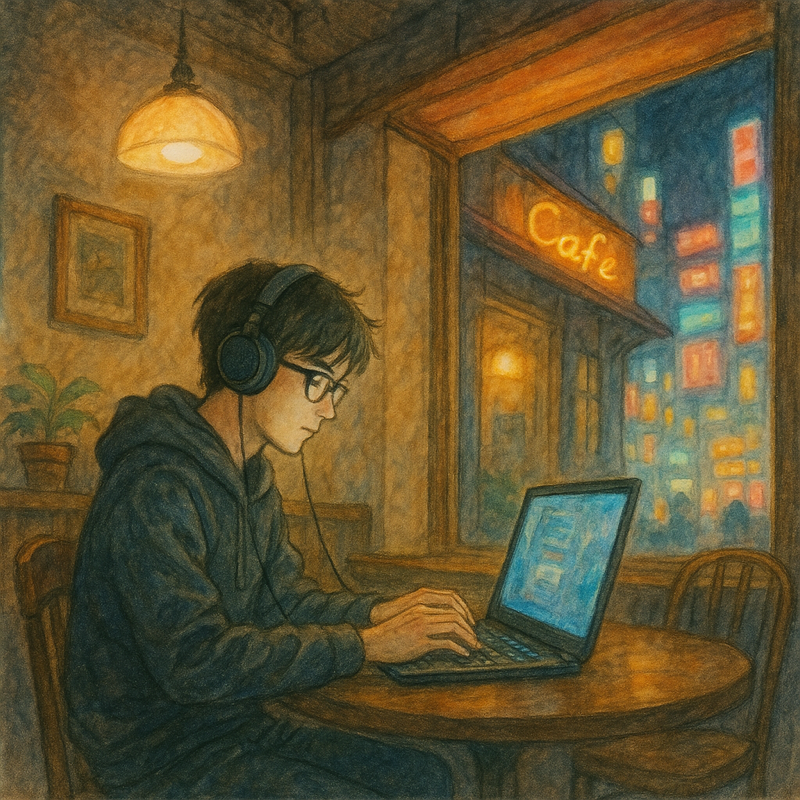
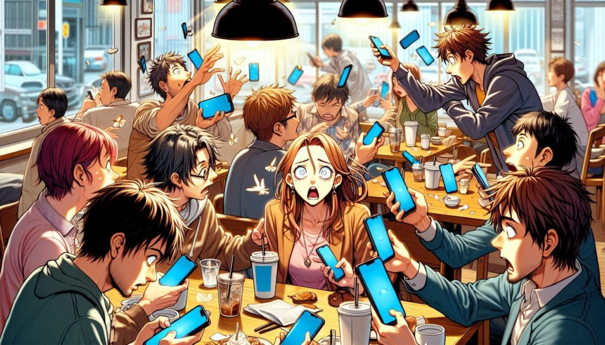
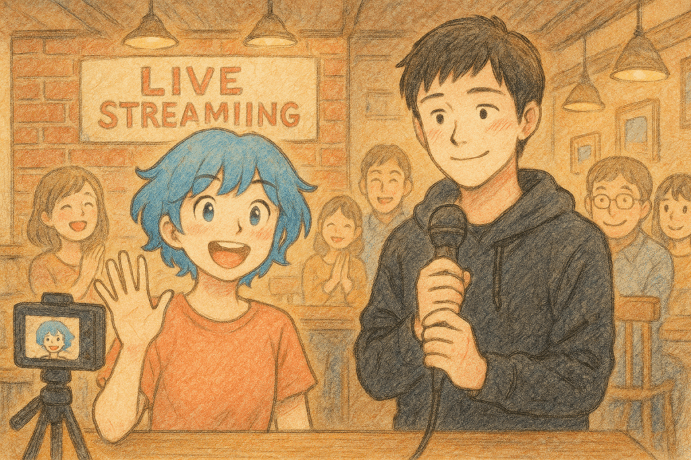
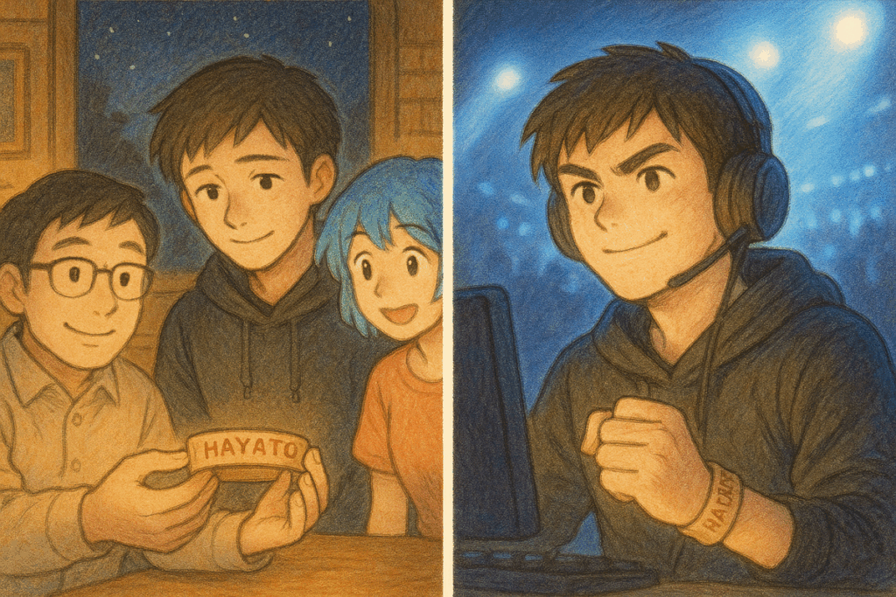
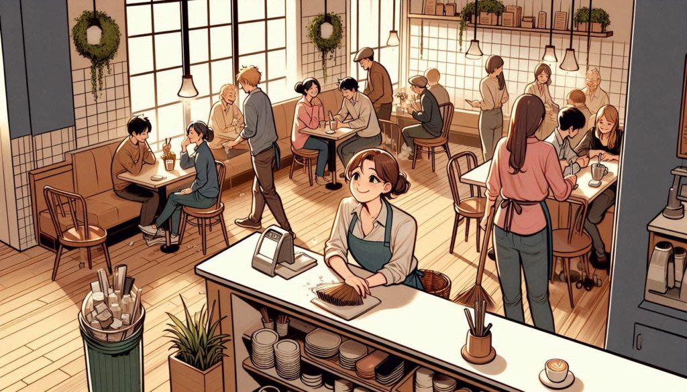

## 第1章: 秋葉原のカフェ

  
秋葉原の大通りは、眩いネオンと活気溢れる人々の声で賑やかだった。しかし、その裏手にひっそりと佇む小さなカフェ「ミッドナイト・ドリフト」は、街の喧騒から切り離されたような静寂と居心地の良さを醸し出していた。25歳のプロeスポーツプレイヤー、中村翔太は、カフェの片隅でゲームの世界に没頭していた。鋭い眼差しを隠す眼鏡越しに見える彼の視線は真剣そのもので、指先が稲妻のようにキーボードを滑っていた。ゲーム「Nexus Legends」界では「SilentStorm」として知られ、誰もが憧れる存在だったが、彼自身は常に孤独を抱えていた。

## 第2章: 出会い

いつもの練習を終えて息を吐いた翔太の前に、温かな笑顔のカフェオーナー、佐々木真理が現れた。「翔太くん、コーヒーもう一杯どう？」と真理が優しく問いかけた。「ええ、お願いします」と翔太は淡々と応えたが、その瞳にはどこか寂しさが滲んでいた。

その時、カフェのドアが軽やかに開き、青い髪を揺らしてカメラを手にした若い女性が入ってきた。彼女は東京のサブカルをテーマにした人気YouTuberの鈴木さくらだった。翔太は初めて見るその明るい姿に、一瞬目を奪われた。

## 第3章: 変化の兆し

日が経つにつれ、翔太はさくらと交わす会話を楽しみにするようになっていった。さくらの陽気さと素直な好奇心は、これまで翔太が閉ざしていた心の扉を少しずつ開けていった。

大会の一週間前、カフェではさくらが小さなライブ配信イベントを開催していた。真理が微笑んで「翔太くんも参加したら？」と促すと、彼は不安げに目を逸らした。しかしさくらの明るい笑顔に背中を押され、「僕も参加します」と声を出してしまった自分に驚きつつ、胸に新しい感情の芽生えを感じていた。

## 第4章: 大会前夜

  
国際大会前夜、緊張が翔太の心を支配していた。落ち着きを取り戻すためにいつものカフェを訪れると、真理とさくらが待っていた。「応援に来たのよ」とさくらは照れ臭そうに小箱を渡した。箱の中には彼の名前が刺繍された特製のリストバンドがあった。「これがあれば、一人じゃないって感じられるでしょ？」と真理がそっと呟く。その温もりに触れた翔太は、久しぶりに自然な笑みを浮かべた。

## 第5章: 勝利とその先へ

  
決勝戦の舞台に立った翔太は、これまでにないプレッシャーに襲われていた。だが、リストバンドを見つめると、さくらと真理、そして自分を支えてくれる多くのファンの顔が心に浮かんだ。その瞬間、彼のプレイは鮮やかさを増し、世界のトッププレイヤーを次々と圧倒した。そして、彼は念願の世界チャンピオンに輝いた。

## エピローグ

優勝後、翔太は急激に注目を集めるようになったが、何よりも大切な変化は彼自身の心の中にあった。自分が本当に求めていたのは孤独な頂点ではなく、人との繋がりであることを知ったのだ。

ある穏やかな午後、カフェで翔太が真理やさくらと笑い合っていた時、彼は悟った。彼が手にした最も価値ある勝利は、ゲームの中ではなく、この温かな人間関係の中にあったのだと。

「沈黙の嵐」は新たな響きを持ち、自分と周りの人々の声と共鳴していた。

