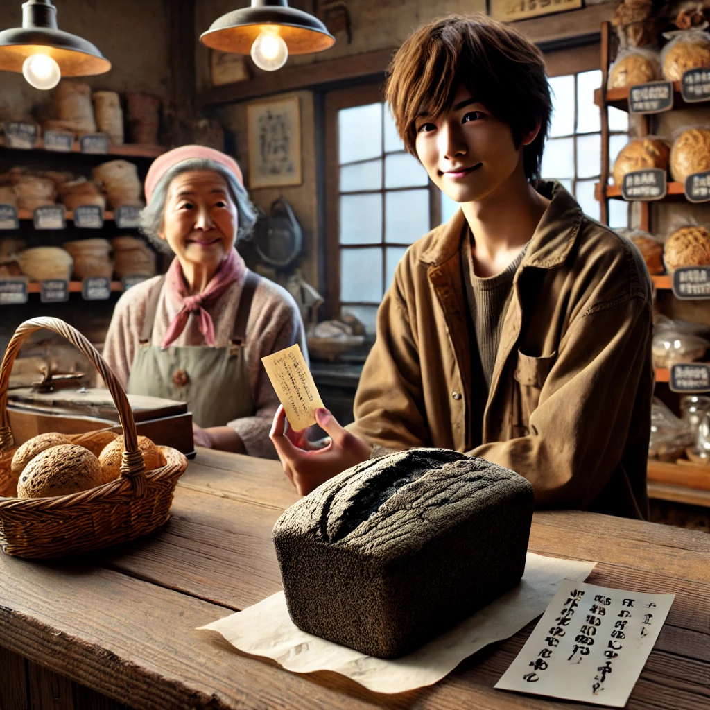

誠（まこと）は穏やかな笑顔をたたえる青年だった。私立中学校の国語教師として、日々生徒たちに文学の魅力を伝えることに情熱を注いでいる。しかし最近、彼の授業に興味を示さない生徒が増え、特に手を焼いているのが大翔（ひろと）という男子生徒だった。授業中は無気力な態度を崩さず、話しかけても「別に」と短い返事を返すばかりだ。誠は彼と向き合おうと努力するものの、何度も壁にぶつかり、疲弊していた。

そんなある日の午後、誠は近所のパン屋を訪れた。店内に入ると、カウンターには黒くてゴツゴツとした不思議なパンが並んでいた。横には「石パン」と書かれた看板と、「大変硬いのでお気をつけください」という注意書きがある。興味を引かれた誠はそのパンを購入して家に持ち帰った。

家に戻り、パンを包みから取り出した誠は驚いた。どこからどう見ても、まるで石そのもののようだった。包丁を試してもびくともしない硬さに苛立ちを感じ、テーブルに放り出そうとした瞬間、底に小さな紙切れが挟まっていることに気づいた。そこにはこう書かれていた。

「人生の困難は、このパンのようなもの。最初は不可能に見えても、忍耐と工夫があれば、必ず道は開ける。」

その言葉は、誠の胸の中にじんわりと染み渡った。これまで何度も生徒たちに伝えようとしたこと、自分自身も忘れかけていた教訓が、突然形となって彼の前に現れたような気がした。

翌日、誠は学校に向かう途中でこのメッセージのことを思い出していた。特に大翔の姿が頭から離れない。彼の心に届く言葉を探しながら、教室に向かう足取りはどこか軽かった。

授業中、誠はこれまでとは違うアプローチを試みた。ただ教科書を読むだけでなく、生徒たちの興味を引くような話題を混ぜながら話を進めた。途中、大翔に話しかけた。

「大翔、君が最近好きだと言ってたサッカー選手の記事がここにある。ちょっと読んでみようか。」

大翔は一瞬目を丸くしたが、しぶしぶノートを開いた。その日の授業の終わり、大翔が誠のもとに歩み寄り、「今日の話、面白かった」と小声でつぶやいた。その一言は、誠にとって大きな一歩だった。

誠はその後も、生徒たち一人ひとりに合わせた授業スタイルを模索した。大翔とは少しずつ対話が増え、彼が口にする些細な興味を拾い上げては、授業内容に組み込むようにした。ある日、放課後の廊下で大翔が誠に話しかけてきた。

「先生、俺、最近ちょっと勉強が面白いって思うんだ。でも、まだよくわからないことも多い。」

その言葉に、誠の胸が熱くなった。「わからないことを一緒に見つけていこう。それが先生の仕事だよ。」誠は微笑んで答えた。

数週間後、誠は再びパン屋を訪れた。石パンを買ったことを話すと、店主の由美が笑顔でこう言った。

「あれは特別なパンなんです。困難に立ち向かう力を思い出してほしいという願いを込めて焼いています。」

誠はパン屋を出ると、夕暮れの街を歩きながら、大翔や他の生徒たちの顔を思い浮かべた。「困難は克服するもの」という石パンの教えは、彼の教師としての生き方を変えつつあった。

その後、誠の授業は学校内で評判となり、彼の教室にはいつも笑顔と活気が溢れていた。誠の机の上には、あの石パンが今も置かれている。それを見るたびに、彼は自分が何のために教師をしているのかを思い出すのだった。

そして、未来を見据えながら、誠はこれからも生徒たちとともに歩み続けていく決意を新たにする。「石パンの教え」は、誠とその生徒たちの人生に確かな光を灯し続けるのだ。

## **The Lesson of the Stone Bread**

Makoto was a young man with a gentle smile. As a Japanese language teacher at a private middle school, he poured his passion into conveying the beauty of literature to his students. However, more and more of them seemed disinterested in his lessons lately, and one student, in particular, gave him the most trouble—Hiroto. During class, Hiroto maintained an apathetic attitude, rarely responding with more than a curt “whatever” when spoken to. Despite Makoto’s efforts to connect with him, every attempt felt like hitting a wall, leaving Makoto emotionally drained.

One afternoon, while wandering through the neighborhood, Makoto stepped into a small bakery. At the counter, he noticed an unusual array of black, rugged-looking bread labeled as “Stone Bread.” Beside the label, a warning read, “Extremely hard, please handle with care.” Intrigued, Makoto decided to purchase one and brought it home.

When he unwrapped the bread, Makoto was stunned. It looked exactly like a stone. He tried cutting it with a knife, but the blade wouldn’t even dent its surface. Frustrated, he almost tossed it onto the table when he noticed a small slip of paper tucked underneath. It read:

“Life’s challenges are like this bread. They may seem impossible at first, but with patience and ingenuity, a way will always open.”

The words seeped into Makoto’s heart. It felt as though the lesson he had so often tried to teach his students—and had almost forgotten himself—was suddenly given tangible form right in front of him.

The next day, as Makoto walked to school, the message lingered in his mind, especially Hiroto’s face. He pondered how to find words that could reach the boy’s heart. With this thought, he entered the classroom with a lighter step than usual.

During the lesson, Makoto tried a different approach. Rather than sticking to the textbook, he introduced topics designed to spark the students’ interest. Midway through, he turned to Hiroto.

“Hiroto, I have an article here about a soccer player you mentioned liking. Care to read it with us?”

Hiroto’s eyes widened slightly in surprise, but he reluctantly opened his notebook. By the end of the class, Hiroto quietly approached Makoto and mumbled, “Today’s lesson was… interesting.” That single word felt like a monumental breakthrough to Makoto.

Makoto continued to adapt his teaching style to suit each student, gradually increasing his dialogue with Hiroto. He paid close attention to the boy’s small expressions of interest and wove them into his lessons. One afternoon, Hiroto spoke to him in the hallway after school.

“Sensei, I think studying is kinda fun lately. But… there’s still a lot I don’t get.”

Makoto’s heart swelled with warmth. “That’s okay, Hiroto. Let’s figure it out together—that’s what I’m here for.” He smiled reassuringly.

A few weeks later, Makoto revisited the bakery and shared his experience with Yumi, the shopkeeper. She beamed at his story and said, “That bread is special. I bake it to remind people of the strength they have to face life’s challenges.”

Leaving the bakery, Makoto strolled through the streets at sunset, recalling Hiroto and his other students. The lesson of the Stone Bread—that challenges are meant to be overcome—had begun to reshape his approach to teaching and his outlook on life.

In the weeks that followed, Makoto’s classes gained a reputation within the school. His students were more engaged, and the classroom buzzed with energy and smiles. On his desk, the Stone Bread remained, a constant reminder of why he became a teacher—to guide his students not only through academics but through the challenges of life.

As he looked to the future, Makoto renewed his commitment to walking alongside his students on their journeys. “The Lesson of the Stone Bread” would continue to light the way for him and those whose lives he touched.
