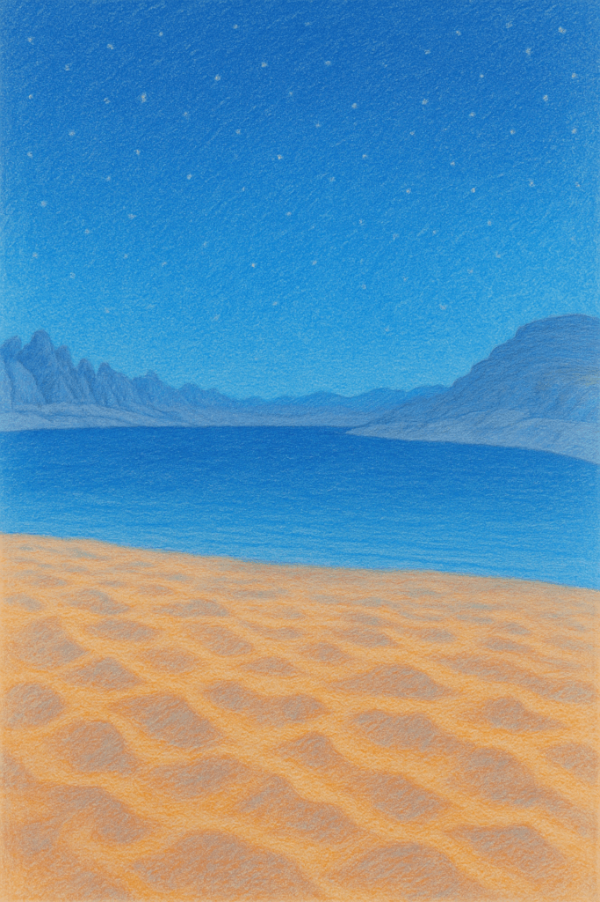

# 砂漠を素足で歩く万博体験――ヨルダン館と“リアル・ヨルダン”の魅力ガイド

> **本物の砂漠、死海の癒し、そしてペトラのロマン。**  
> 2025年大阪・関西万博に登場する**ヨルダン館**は、22トンの砂を敷き詰めた“歩ける砂漠”と死海スパ体験で話題です。ここではパビリオンの楽しみ方と、実際に現地へ飛ぶときに役立つ最新トレンドをまとめました！

* * *

## 1\. Osaka Expo 2025とは？

2025年4〜10月に夢洲で開催。テーマは「いのち輝く未来社会のデザイン」。海外パビリオンの**タイプB**としてヨルダン館が最速で引き渡され、内装工事が進行中です。

* * *

## 2\. ヨルダン館の３大体験ポイント

1. **砂漠ウォーク**  
    ワディ・ラムの赤砂22 tを輸送。素足 or フットカバーで自由に歩けます。

3. **死海ハンドスパ**  
    死海塩・泥を使ったハンドマッサージ（2,000〜2,500円／10〜20分）。当日現地予約制。

5. **カルチャー＆チル**  
    デーツ試食・サンドアート展示・オアシス休憩スペース。

_滞在目安: パビリオン鑑賞＋スパで約45分。_

* * *

## 3\. なぜ今ヨルダンが熱い？最新トレンド

- **ペトラ遺跡**: 4月の来訪者が前年同月比42%増と急回復。

- **Wadi Rum**: 映画ロケ地ツアー、キャメルライド＆星空グランピングが人気。

- **Dead Seaコスメ**: 世界市場は2034年に25億ドル規模へ、日本でも“泥パック”動画が拡散中。

* * *

## 4\. パビリオン攻略Tips

| 項目 | ポイント |
| --- | --- |
| 開館時間 | 10:00〜18:00（予定・変更可能性あり） |
| 予約 | 入館不要／スパ体験は当日現地受付 |
| 服装 | 砂漠エリアはサンダル推奨、ヒール不可 |
| 所要時間 | 館内見学20分＋スパ20分＝約45分 |
| SNS | ハッシュタグ **#ヨルダン館体験** で投稿すると館内モニターに表示予定 |

* * *

## 5\. 旅に出たくなる！本場ヨルダンおすすめスポット

1. **ペトラ遺跡** – 早朝の“バラ色”が絶景。

3. **ワディ・ラム砂漠** – 4WD & 星空キャンプで映画の世界へ。

5. **死海** – 高ミネラル泥パックで#美肌旅。

7. **アンマン旧市街** – ローマ劇場と屋台フードをハシゴ。

9. **アカバ** – 紅海でダイビング。

_※NEWTなど旅行サイトでは2025年以降のセール運賃が随時更新されています。_

* * *

## 6\. まとめ

ヨルダン館は“砂”と“癒し”で五感に触れるパビリオン。体験後はそのままリアル砂漠と死海へ――そんな流れが2025年の新トレンドになりそうです。

> **NEXT ACTION**  
> ・ヨルダン館で写真＆SNS投稿  
> ・気持ちが盛り上がったら航空券をチェック！

* * *

### この記事の使い方（キャンバス整形メモ）

- **ヘッダー画像**: ペトラ遺跡 or 砂漠サムネ（比率16:9推奨）

- **色見本**: 砂漠サンド #D8A36F ／ 死海ブルー #87B5D6

- **フォント**: 見出し＝Noto Sans JP Bold、本文＝Noto Sans JP Regular

- **装飾**: ブロック引用 > を多用してリズム感

- **CTAボタン**: Canvaの「角丸ボタン」→リンク挿入で旅行サイトへ

Good luck & have fun on your desert journey!
