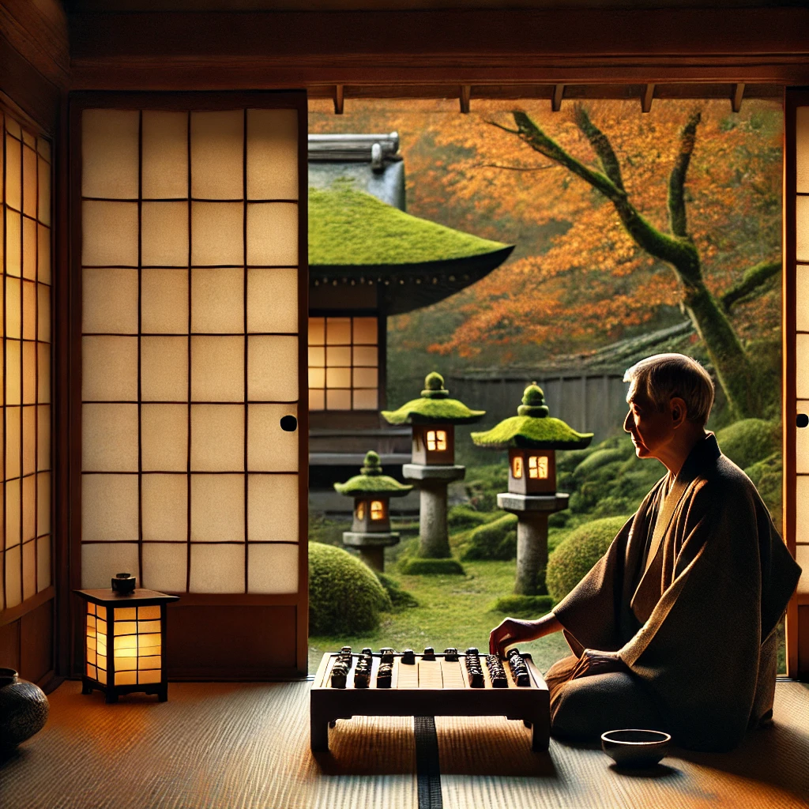
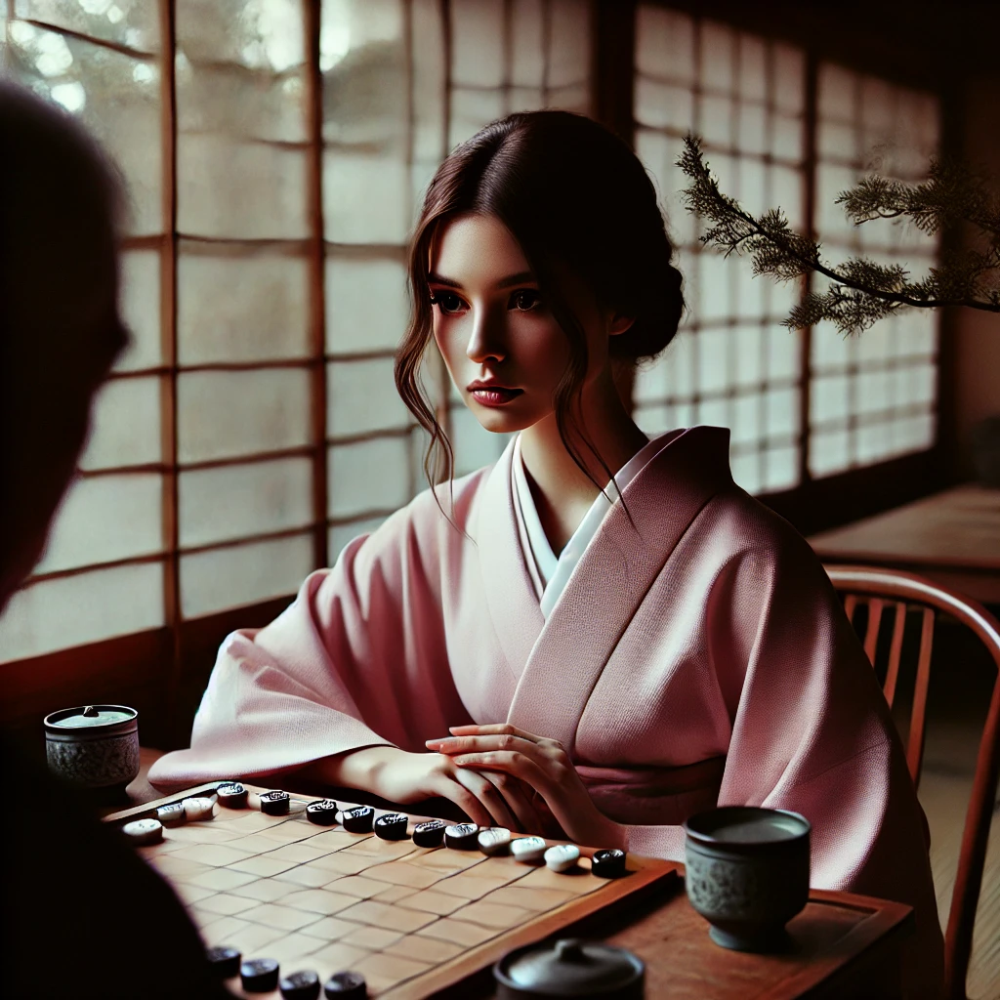
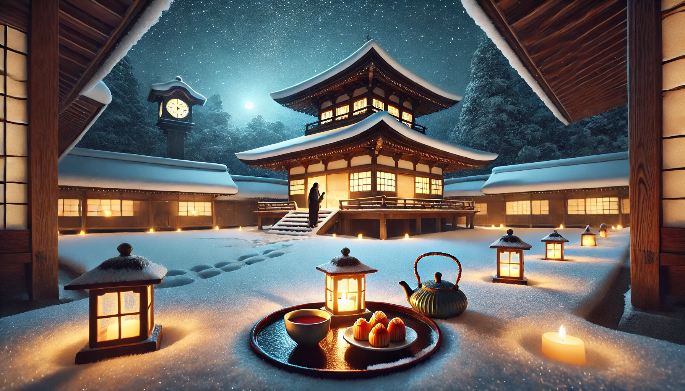

晩秋の京都。山並みを背に広がる街並みは、朱に染まった紅葉で埋め尽くされている。冷たい風が通り過ぎるたび、落ち葉が舞い上がり、寺院から響く鐘の音がその風に乗って遠くまで届いていた。夕焼けに染まる空の下、古都は時間を忘れたような静けさに包まれていた。

小さな茶室では、松田龍平が座していた。茶室の中は、外の世界から切り離されたかのように静寂が支配している。襖を開けると、手入れの行き届いた庭園が広がり、苔むした石灯籠が秋の夕日に照らされていた。その光が障子越しに揺らぎ、畳の上に柔らかな影を落としている。磨き上げられた将棋盤が彼の前に置かれ、整然と並んだ駒がその緊張感を物語っていた。

やがて、石川千尋が現れた。24歳の彼女は、大学院で日本の伝統文化を研究する学生であり、薄桜色の着物を身にまとっていた。その姿は秋の景色と調和し、見る者の目を引きつける。茶室の外で風が松の枝を揺らす音が微かに聞こえ、千尋の緊張した息遣いが静かな空間に溶け込んだ。

「失礼します。」小さな声と共に千尋が頭を下げる。龍平は彼女を一瞥し、わずかに頷いた。

対局が始まると、茶室には駒を指す「カチッ」という音だけが響き渡った。その一音一音が、二人の間で交わされる無言の対話だった。龍平の動きは洗練され、駒さばきには迷いがなかった。千尋もまた、観察力と直感を駆使して一手一手を指し、その目は盤上の駒に集中していた。

「これでいいのか……先生の意図を読み切れているだろうか。」千尋の内心には緊張と不安が渦巻いていた。その時、襖越しに庭の木々が風に揺れる音が聞こえた。音は彼女の思考を中断させるが、同時に心を静めるようでもあった。

「先生、私の一手は……間違いだったのでしょうか？」千尋は意を決して口を開いた。声には迷いが混じっていたが、その瞳には真剣さが宿っていた。

龍平は駒を動かしながら、ふっと笑みを浮かべた。「将棋に間違いというものはない。ただ、その一手をどう生かすかが全てだ。」彼の言葉は深く静かに響き、千尋の心に染み込んだ。

夜が更け、月が庭を照らし始める頃、対局は終局を迎えた。千尋は王を失い、敗北を認めて頭を下げた。「先生、ありがとうございました。」その声には敗北を超えた感謝と決意が込められていた。

龍平は柔らかい口調で答える。「焦らず進みなさい。君の旅はこれからだ。」その言葉には未来への希望と励ましが込められていた。

数年後の秋、千尋は自らの弟子たちと向き合っていた。あの夜、龍平に教わった言葉は、彼女の心の中で道標となり、今もなお彼女を導いている。庭で紅葉が舞う中、千尋は静かに微笑んだ。その微笑みは、あの夜の教えが新たな命を宿し、未来へと続いていることを物語っていた。

## **The Quiet of Autumn: A Bond Between Master and Disciple**

Late autumn in Kyoto. The city, set against the backdrop of the mountains, was blanketed in vivid crimson leaves. Each gust of cold wind sent fallen leaves swirling through the air, carrying with it the distant chime of temple bells. Beneath a sunset-streaked sky, the ancient capital was enveloped in a tranquil stillness that seemed to suspend time itself.

In a small tearoom, Ryuhei Matsuda sat alone. The room, secluded from the outside world, was steeped in silence. Sliding open the shoji doors revealed a meticulously maintained garden, where a moss-covered stone lantern stood bathed in the golden hues of the autumn sunset. The lantern’s gentle glow filtered through the shoji screens, casting delicate shadows upon the tatami mats. Before Ryuhei lay a polished shogi board, its perfectly aligned pieces radiating an aura of quiet intensity.

Soon, Chihiro Ishikawa arrived. At 24, she was a graduate student deeply immersed in the study of Japanese traditional culture. Draped in a pale pink kimono, her figure harmonized with the autumn scenery, capturing the eye of any observer. Outside the tearoom, the faint rustling of pine branches in the wind mingled with the sound of her nervous breath, blending seamlessly into the serene atmosphere.

“Pardon me,” she said softly, bowing her head. Ryuhei glanced at her briefly and gave a slight nod in acknowledgment.

As the match began, the only sound to break the silence was the sharp click of shogi pieces moving across the board. Each precise sound echoed as a silent dialogue between the two. Ryuhei’s movements were fluid and deliberate, exuding the mastery of years of experience. Chihiro, on the other hand, relied on her keen observation and youthful intuition, placing each piece with clear intent and unwavering focus.

“Is this the right move? Am I truly grasping the teacher’s strategy?” Chihiro’s thoughts swirled with tension and uncertainty. Just then, the faint sound of wind rustling through the garden trees reached her ears through the sliding doors. The sound interrupted her thoughts, yet somehow also brought a calming clarity.

“Sensei, was my move… a mistake?” Chihiro finally spoke, summoning her courage. Her voice trembled slightly, but her gaze held an earnest determination.

Ryuhei moved another piece and offered a faint smile. “In shogi, there are no mistakes. What matters is how you make use of each move from here on.” His words resonated deeply, carrying a quiet strength that seeped into Chihiro’s heart.

As the night deepened and the moonlight began to illuminate the garden, the match reached its conclusion. Chihiro lost her king, and with a soft exhale, she acknowledged her defeat with a respectful bow. “Thank you, Sensei,” she said, her voice filled not with despair, but with gratitude and newfound resolve.

“Proceed without haste,” Ryuhei replied gently. “Your journey is just beginning.” His words were imbued with hope and encouragement for the future.

Several autumns later, Chihiro stood before her own disciples. The words Ryuhei had imparted to her on that fateful night had become a guiding light, continuing to shape her path. As she watched the crimson leaves dance in the garden breeze, a quiet smile spread across her face—a smile that spoke of lessons cherished and a legacy carried forward. The teachings of that autumn night had found new life, extending their influence into the future.
